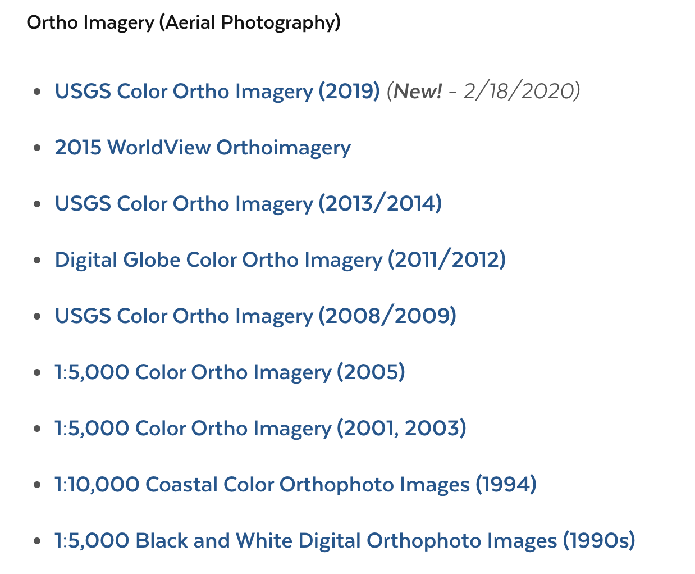
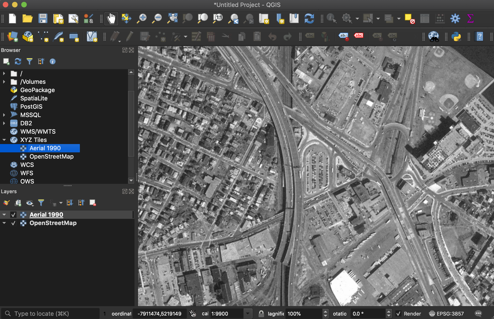

# Massachusetts Aerial Imagery

The MassGIS Portal makes <a target = "_blank" href ='https://docs.digital.mass.gov/dataset/massgis-data-layers#img'>Ortho imagery (aerial photography) available</a> at regular intervals going back to the 1990s.


::: tip Screenshot from the <a target = "_blank" href ='https://docs.digital.mass.gov/dataset/massgis-data-layers#img'>MassGIS Website</a>

:::

## Tutorial goals
This tutorials will walk through how to bring any of these tiled web services into various GIS software.

## Select a Service

Regardless of where and how you want to use these web services, the first step is to select the year you wish to access.

From the <a target = "_blank" href ='https://docs.digital.mass.gov/dataset/massgis-data-layers#img'>MassGIS Website</a>, click on one of the services. In this tutorial, we will be working with the `MassGIS Data: 1:5000 Black and White Digital Orthophoto Images (1990s)`

## Access Options

MassGIS offers a handy breakdown of different ways to access the data.


In the yellow section on the left, you can choose from multiple ways to download <i>portions</i> of the aerial imagery. By clicking on the first option `Download these images from an interactive map`, you will be taken to a page where Massachusetts is broken up into a grid of squares where you can choose any square and download imagery for that area.

This method is a way to address the fact that all imagery data that is made available at extremely high resolution for large swaths of areas is going to be massively large. By breaking the state up into gridded sections, this is one way MassGIS can support downloading.

Instead of downloading the data, this tutorial is going to focus on bringing the whole tiled web service (similar to what you see when you go on Google Maps) into your own web mapping software to use as a basemap, like in QGIS, ArcGIS Online or your own custom app. 

## Use in QGIS

The first step to bringing these tiles into a GIS software is getting formatting the URL for the tile service in the correct way.

You can click on the page `Info for app developers`. This page will give you information about the web service, including the service description and how many zoom levels there are tiles for.

Copy the main URL from your web browser for this page and paste it somewhere. It will look like this:

```
http://tiles.arcgis.com/tiles/hGdibHYSPO59RG1h/arcgis/rest/services/BW_Orthos_Tile_Package/MapServer
```

The next step to getting the proper tile URL is to append the following syntax to the end of the URL you just copied:

```
/tile/{z}/{y}/{x}
```


The full tile service URL will look like this:

```
http://tiles.arcgis.com/tiles/hGdibHYSPO59RG1h/arcgis/rest/services/BW_Orthos_Tile_Package/MapServer/tile/{z}/{y}/{x}
```

Now that you have the correct tile URL, you can bring this layer into QGIS as a basemap!

1. Open <a target = "_blank" href ='./get-started-qgis/'>QGIS</a>. 

2. To get a reference map of real-life geography, in the Browser, which can be toggled on under `View → Panels → Browser`, expand XYZ Tiles and double click OpenStreetMap


3. Zoom in on the basemap in the map document to the area of interest. In this example, we will be using Somerville, MA. 


4. To add the aerial imagery layer, in the `Browser panel`, right-click on `XYZ tiles` and select `New Connection`

::: tip XYZ Tiles → New Connection

:::

5. Enter the following settings

::: tip New XYZ Tile Connection Settings<br>
**Name:** Whatever you want the aerial layer to be called in your map document. Type of service and year could be a good name, for instance, "Aerial photography 1990"<br><br>
**URL:** The URL you created for the tile endpoint<br><br>
Example:
```
http://tiles.arcgis.com/tiles/hGdibHYSPO59RG1h/arcgis/rest/services/BW_Orthos_Tile_Package/MapServer/tile/{z}/{y}/{x}
```
<br>
Use the `Info for app developers page to determine how many zoom levels are available. <br><br>
<b> Min. Zoom Level:</b>0<br><br>
<b> Max. Zoom Level:</b> 20<br><br>
Everything else default<br><br>
:::


6. You will now see your new tile layer as an option in the `browser` under `XYZ Tiles`. Double-click the new layer to add it to the document.



You can now use this layer as a basemap. You can bring in other datasets to compare it to, like other historical layers, or modern data. You can use it as a reference to create you own point, line or polygon data, which can then be exported from QGIS for many different uses.

## Use in ArcGIS Online

The first step to bringing these tiles into a GIS software is getting formatting the URL for the tile service in the correct way.

You can click on the page `Info for app developers`. This page will give you information about the web service, including the service description and how many zoom levels there are tiles for.

Copy the main URL from your web browser for this page and paste it somewhere. It will look like this:

```
http://tiles.arcgis.com/tiles/hGdibHYSPO59RG1h/arcgis/rest/services/BW_Orthos_Tile_Package/MapServer
```

Now that you have the correct tile URL, you can open ArcGIS Online.

If you do not have an ArcGIS Online public account, you will need to <a target = "_blank" href ='https://doc.arcgis.com/en/arcgis-online/get-started/create-account.htm#:~:text=From%20the%20website%2C%20click%20the,last%20name%2C%20and%20email%20address'>make one first</a>.


After logging in and selecting the `Map` menu option, choose `Add layer from web` from the map options.


Under `What type of data are you referencing` you can leave the default value selected, `An ArcGIS Web Server Service` 

In the URL, copy the tile service URL you copied from MassGIS.

Example:

```
http://tiles.arcgis.com/tiles/hGdibHYSPO59RG1h/arcgis/rest/services/BW_Orthos_Tile_Package/MapServer
```

If you want this layer to serve as the basemap, select `Use as basemap`. If, instead, you want it to be just another data layer that appears on top of the default reference basemap, leave this option unchecked.

Select `Add layer`

The Massachusetts tiles will appear. You can now add other data layers, and configure other web mapping options. This map is shareable on the web by clicking the `Share map` button.


## Leaflet Web Mapping

To use these layers in a custom Leaflet web app, you can format the tile service syntax like so:

``` javascript 
L.tileLayer(
    'http://tiles.arcgis.com/tiles/hGdibHYSPO59RG1h/arcgis/rest/services/BW_Orthos_Tile_Package/MapServer/tile/{z}/{y}/{x}',{ 
        attribution: "MassGIS"
    }
);
```