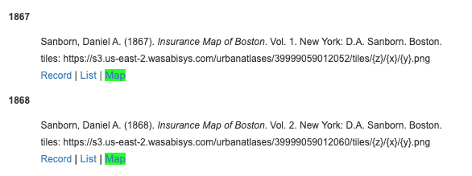
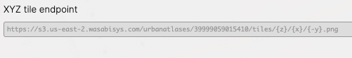
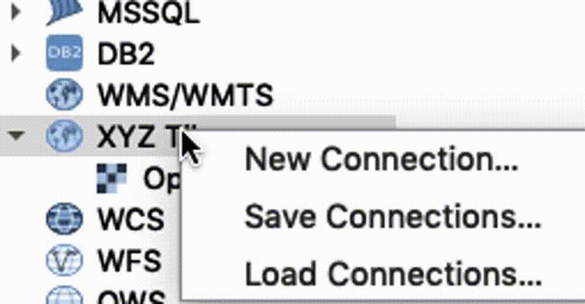
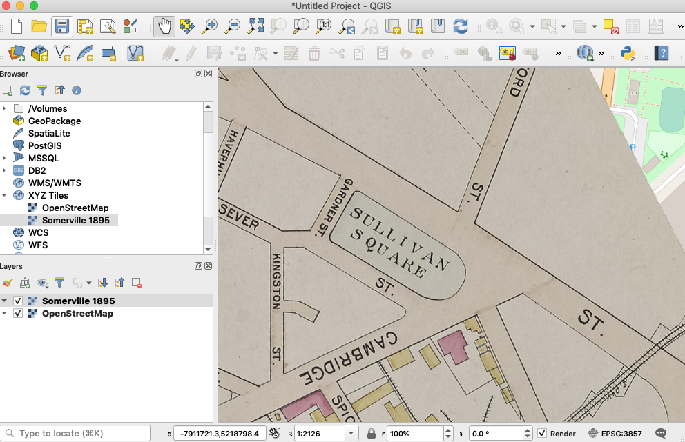

# Bring BPL Atlas Tiles into QGIS

::: warning Actively in development
Our Atlascope data processing, describing and hosting workflows have improved since these guides were first created. We are actively working on making this data more accesible, at which point we will update this series of guides and documentation with the most current information. Meanwhile, you can still use these guides to learn about the project. 

For direct help accessing these datasets, submit a [data request]("https://www.leventhalmap.org/research/geospatial/").
:::


## Understanding Atlascope tiles
With [Atlascope](https://atlascope.leventhalmap.org), you can digitally access our collection of historical urban atlases of the Boston area. Over one hundred layers are now available as georeferenced atlas mosaics that you can either explore and compare within our application or bring into a GIS for your own storytelling or analysis. We have also converted these mosaics into web-based tiles that anyone can access and use as data in a variety of GIS systems. This guide will walk through some of the ways to get started using these tiles in your projects. 

### What are our atlas tiles?
After digitally scanning, georeferencing, and stitching together all of the plates of an atlas, we combine these into one large .tif file known as the atlas **mosaic**. Because the mosaic file is so large, it cannot be rendered quickly in a GIS application. For this reason, we must generate a **tile cache**. Tiling essentially breaks the mosaic down into a series of small .png image files for various browser zoom levels. Rather than reload the mosaic in complete detail every time you pan or scroll, the GIS will only have to load the smaller files relevant to your area of focus at your chosen zoom level. This process allows you to use layers with large amounts of data with much greater ease.

### Ways to use our atlas tiles
- **As basemaps**
<dd> <i> Bring mosaiced historical maps into your document as basemaps </i> </dd> 
- **For historical comparison**
<dd> <i> Compare data about the same geography over different years </i> </dd>
- **Digitize features**
<dd> <i> Create your own geometric datasets from the historical imagery </i> </dd>
- **Analysis and storytelling**
<dd> <i> Combine inferred data from atlas layers with other datasets for analysis or storytelling </i> </dd>

### Where do these tiles live? 
Another difference between a mosaic and a tile cache (or XYZ layer, as we sometimes call them, referring to the `XYZ tile pyramid schema` ) is how they are stored. While the mosaic file must be downloaded onto your device or an external drive in order to be accessed in a GIS, tiles are hosted at special URLs that GIS software on any computer can access. These URLs are called **tile endpoints**. 

## Finding and accessing BPL atlas tile layers
There are, generally speaking, two ways to find Atlascope tile endpoints for your project. Your choice will depend on what information you are beginning your project with.

### Finding layers by atlas
If you already know the atlas volume you wish to work with, either by the name, year or call number, you can look up the **tile endpoint** in a number of ways.

#### Find all Atlascope data by referencing our documentation

Our [Use Digitized Urban Atlases as GIS Source Data](../documentation/access-urban-atlas-data.html) documentation contains detailed information on how to access *all* underlying Atlascope data (tiles, georeferenced control points, mosaic TIFFs, and boundary footprints)

::: tip NOTE
This documentation page assumes prior knowledge with GIS and data tools.
:::


#### Find endpoints using our BPL atlas libguide
Citations for all BPL urban atlases, which include tile links where available, are also available in our Historical Urban Atlases libguides. Urban atlases for geographies encompassing or within the City of Boston can be found [here](https://guides.bpl.org/urban-atlases/list), while those corresponding to other Boston-area towns and cities can be found [here](https://guides.bpl.org/mass-urban-atlases).

::: tip Example libguide citations

:::


### Using Atlascope to find layers geographically
"the visual approach"

The best way to find available layers by geography is to use <a target = "_blank" href ='https://atlascope.leventhalmap.org/'>Atlascope.</a>

Zoom in to a location in Atlascope, and the menus will update with every atlas we have available for that precise location. 

Engage with the year layer you are interested in by turning it on in the menu, and clicking `About this map`

At the bottom of each layer's `About this map` page is a link to the tile endpoint.

::: tip Example Atlascope layer tile link

:::


## Using *Atlascope* tiles with GIS software

### Using our atlas tiles with QGIS

1. Copy the URL to the atlas layer you want to use by [referencing the documentation][(https://geoservices.leventhalmap.org/cartinal/resources/documentation/access-urban-atlas-data.html), [searching in Atlascope](<a href ='./atlascope-tiles.html#Finding-layers-by-geography'>searching in Atlascope</a>, or <a target = "_blank" href ='https://guides.bpl.org/urban-atlases/list'>using our library guides.</a>

2. Open QGIS. 

3. To get a reference map of real-life geography, in the Browser, which can be toggled on under `View → Panels → Browser`, expand XYZ Tiles and double click OpenStreetMap


4. Zoom in on the basemap in the map document to the area of interest. In this example, we will be using Somerville, MA. 


5. To add the historical atlas layer, in the `Browser panel`, right-click on `XYZ tiles` and select `New Connection`

::: tip XYZ Tiles → New Connection

:::

6. Enter the following settings

::: tip New XYZ Tile Connection Settings<br>
**Name:** Whatever you want the atlas layer to be called in your map document. Geography and year could be a good name, for instance, "Somerville 1895"<br><br>
**URL:** The URL you copied for the tile endpoint<br><br>
```
https://s3.us-east-2.wasabisys.com/urbanatlases/{volume-identifier}/tiles/{z}/{x}/{-y}.png
```
<br>

**Min. Zoom Level:** 13<br><br>
**Max. Zoom Level:** 20<br><br>
Everything else default<br>
:::


7. You will now see your new tile layer as an option in the `browser` under `XYZ Tiles`. Double-click the new layer to add it to the document.



You can now use this layer as a basemap. You can bring in other datasets to compare it to, like other historical layers, or modern data. Alternatively, in QGIS you can use this historical layer to create your own point, line or polygon dataset by digitizing features from the historical basemap and adding attribute information to those features. 


### Using our atlas tiles with ArcGIS Online

ArcGIS Online (AGOL) is one of the more popular out-of-the-box web mapping tools. With it, users can make free online web maps from many different data sources.

AGOL does allow one to bring in XYZ tilesets to display in a shareable web map. Unfortunately, AGOL does not accommodate the TMS specification our tiles were initially created in, it only allows for the XYZ specification. We are in the process of translating our Boston tiles to the XYZ pyramid schema, in order to ensure compatibility with this popular tool. While this transition process is underway, if there are particular layers you are interested in working with right now in ArcGIS Online, please <a target = "_blank" href ='https://geoservices.leventhalmap.org/cartinal/resources/request.html'>let us know</a>, and we will prioritize these tilelayers and get them formatted for you in a speedy manner. To inquire about the schema specifications for any given atlas volume, please consult our [documentation](https://geoservices.leventhalmap.org/cartinal/resources/documentation/access-urban-atlas-data.html), or drop us a line.


### Leaflet

If you are planning to use a Boston atlas which has not yet been converted from the TMS pyramid specification to the XYZ specification, please note that Leaflet does not accept the -y parameter, and you will need to format the tile definition in Leaflet in the following way, by adding the `tms: true` flag.

``` javascript
L.tileLayer(
    'https://s3.us-east-2.wasabisys.com/urbanatlases/39999059015998/tiles/{z}/{x}/{y}.png', {
        tms: true, 
        attribution: 'Leventhal Map & Education Center'
    }
);
```