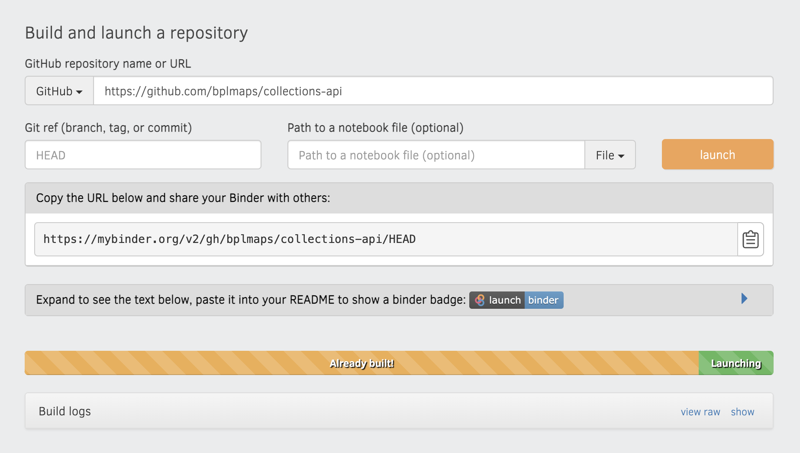

# Accessing LMEC Collections via API

## APIs at the Map Center

All of the items in the [Map Center's collections](https://collections.leventhalmap.org) are compliant with [Digital Commonwealth's API protocol](https://www.digitalcommonwealth.org/api) and can be easily queried using it. This guide contains two Jupyter notebooks with instructions on how to get started with both APIs: the JSON API and the IIIF API.

Read on to learn about the difference between these APIs, when to use one over the other, and how to parse the complex web of metadata beneath each map in our collections!

::: tip

In order to access the Jupyter notebooks, you can either run them online in [Binder](https://mybinder.org), or download and run them in [Anaconda](https://www.anaconda.com/) or [VS Code](https://code.visualstudio.com/download). If you've never used Jupyter notebooks or Binder before, check out [our primer](./jupyter-mybinder.md) before diving in. If you choose to run the notebooks locally, be sure to [have `pandas` installed](https://pandas.pydata.org/docs/getting_started/install.html).

:::

## JSON API

The JSON API is a method for exposing metadata about search results and individual items. Retrieving an individual map's `json` data is as easy as appending `.json` to the end of the URL. For example:

```markdown
# a normal URL, links to item page
    https://collections.leventhalmap.org/search/commonwealth:3f463198b

# URL to JSON data
    https://collections.leventhalmap.org/search/commonwealth:3f463198b.json
```

To retrieve search results (e.g., multiple items) as `json`, simply append `.json` directly after `search` instead:

```markdown
# a normal URL, returns a collections search
    https://collections.leventhalmap.org/search?utf8=%E2%9C%93&search_field=all_fields&q=dorchester&search_field=all_fields

# URL to return JSON data
    https://collections.leventhalmap.org/search.json?utf8=%E2%9C%93&search_field=all_fields&q=dorchester&search_field=all_fields
```

To learn more about querying our collections, [click this link](https://hub-binder.mybinder.ovh/user/bplmaps-collections-api-0b489kuw/doc/tree/01_json-api.ipynb) or paste the following link

    https://github.com/bplmaps/collections-api
    
into <https://mybinder.org> and `Launch`!



## IIIF API

The [international image interoperability framework (IIIF)](https://iiif.io/) is a standardized protocol for high-resolution image transfer. In effect, it's a metadata standard that is increasingly popular among libraries, museums, and other digital collections portals across the world.

With IIIF, it's easy to read and expose image metadata from a URL. You can transfer high-quality images as regular image files through stable links, as well as view them in tools like Mirador or OpenSeadragon for a richer experience.

Since the BPL, and by extension the Map Center, is completely IIIF compliant, we've built tools like panel-truck and MovieMaps on top of the IIIF protocol. The next-generation georeferencing service, Allmaps, also relies on IIIF to warp maps in the browser.

Learn more about retrieving image data from the IIIF API by [clicking this link](https://hub-binder.mybinder.ovh/user/bplmaps-collections-api-0b489kuw/doc/tree/02_iiif-api.ipynb) or pasting

    https://github.com/bplmaps/collections-api

into Binder.

