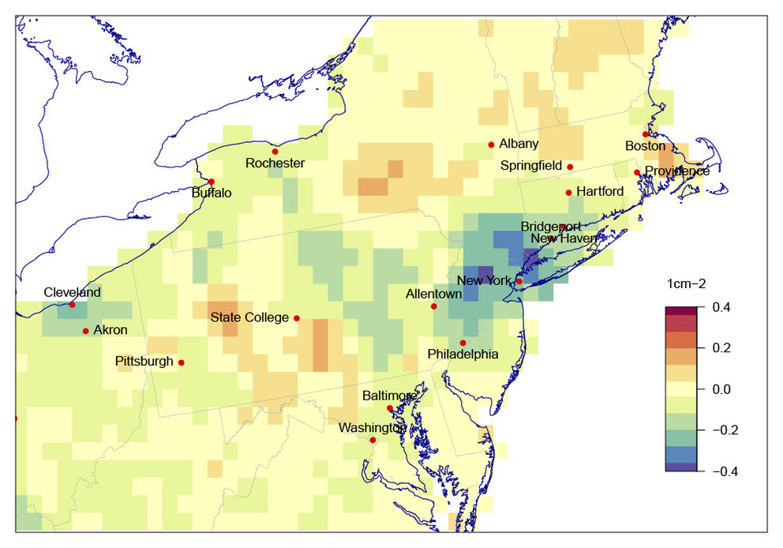
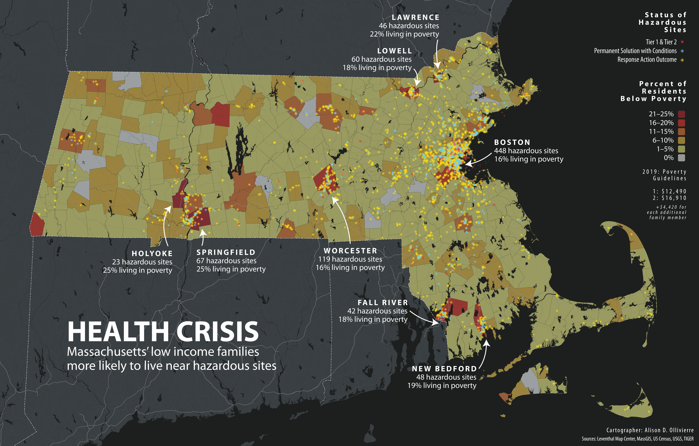

# Feature data

## Types of feature data

* **Review: Feature data describe “where” something is happening.**
  * Feature data refers to the actual *geography* on the earth's surface
  * Some features are possible to see in real life, like the trace of a roadway or river
  * Some features are invisible, like the boundaries of a state or a census tract
  * We also call it the **geometry** or the **shape**
* There are two types of feature data: **raster** and **vector**
  * **Raster data** is like a giant piece of gridded paper, where each cell is a section of the Earth's surface
  * **Vector data**  is like a game of connect the dots
    * Vector data has three main types: **points, lines, and polygons**  
  * Remember, a computer is not very smart when it comes to shapes!
    * It doesn't know what "a circle" is, and certainly not what "the shape of Massachusetts" is
    * Raster and vector data are both methods for creating shapes out of simple numbers and rules

    ::: tip

    Raster data is like mosaics: tiles of equal size that when arranged and colored in, make a picture. Vector data is like stained-glass: shapes are pre-cut and glued together to create an image.

    :::

## Raster data: the earth as a spreadsheet

* In this map, a grid is laid on top of the northeastern US, and each cell has an attribute (in this case, NO2 emissions, visualized as colors)

<figure>

<figcaption>

A map showing air quality using raster data—a grid of equally sized squares. Source: [Penn State Institute for Computational and Data Sciences](https://www.icds.psu.edu/air-quality-data-during-covid-19-may-help-improve-models-guide-interventions/)

</figcaption>

</figure>

## Vector data: connecting dots into shapes

* In this map, the boundaries of states and the counties inside them are vector geometries
  * Each shape is made from dozens of points connected together in order
  * Because the points form a closed loop in these examples, they are **polygons**
  * The location of Boston is also vector data; it's a **point** because it's one-dimensional

<figure>

<figcaption>

Map showing improved health metrics around Boston, using vector geometry Source: [NOAA Climate.gov](https://www.climate.gov/news-features/featured-images/boston%E2%80%99s-ambitious-climate-plan-could-save-hundreds-lives-and-billions)

</figcaption>

</figure>

---
## Comprehension check: identify types of data

#### Map 1: Health Crisis

* Can you identify which types of geospatial data are used in this map of hazardous sites and poverty in Massachusetts?
* Be specific: identify each element you see on the map and define what type of geometry it is (**raster** or **vector**, and, if it's vector, **point, line, or polygon**)

<figure>

<figcaption>

Source: [Norman B. Leventhal Map & Education Center at the Boston Public Library](https://collections.leventhalmap.org/search/commonwealth:rr173g31r)

</figcaption>

</figure>

<hideable title = "Check your responses for 'Health Crisis'">

* The towns and cities (colored yellow, orange, and red according to the share of population below the poverty line) are **polygons**
* The shape of the states are also **polygons**
* The hazardous site dots are **points**
* Bonus points if you got these: the highways, shown in white in the surrounding states are **lines**! Some of the rivers are also **lines**, while waterbodies like the Quabbin Reservoir are **polygons**

</hideable>

#### Map 2: Boston Open Space and Supermarkets

* What type of vector data are used to represent the supermarkets in this map of Boston?
* What about the parks?
* What about the neighborhoods?

<figure>

<figcaption>

A map showing Boston's supermarket locations and open spaces in the city, [Norman B. Leventhal Map & Education Center at the Boston Public Library](https://collections.leventhalmap.org/search/commonwealth:ht250c58r) (2016). 

</figcaption>

</figure>

<hideable title="Check your responses for Boston Open Space and Supermarkets">

* The parks are **polygons**
* The supermarkets are **points**, but the points are styled to look like shopping carts
  * The convention of using a **dot** to represent a point is just that—a representational convention. A point isn't "really" a dot to a computer, it's just a single mathematical coordinate
* The neighborhood boundaries are **polygons**

</hideable>

<hideable Title = "Read the full text of this section">

We have many ways to describe physical features of the world around us: a road can be narrow, wide, winding, straight, rocky, dirt, paved. We understand, inherently, that the boundary between ocean and dry land is not a perfect line: it changes over the course of the day. But computers can’t handle all of this complexity. They need us to simplify all of the nuance and intricacy of the physical world so they can interpret and represent it.

There are just two ways that computers can see the world and make shapes to represent it. We, in turn, have to create data in these two forms. On one hand, there is **raster data**, which represent the world like a vast mosaic, dividing up into a grid of tiles of equal size. On the other hand, **vector data** represent the world like a stained glass window, with shards of glass cut into different shapes and sizes and soldered together.

One type of geospatial data is not better than the other: each is suited to certain types of mapping exercises. Raster data are often used to make maps that describe phenomena that are continuous across space, such as types of land cover (forest, marsh, swamp, desert, etc) or air temperature. On the other hand, vector data are used with phenomena that have discrete spatial boundaries, like election results, which hew to election district boundaries, or building value, which hew to tax parcels.

<figure>

</figcaption>

A map showing air quality using raster data—a grid of equally sized squares. Oranges and reds indicate higher concentrations and greens and blues showing lower concentrations, [Penn State Institute for Computational and Data Sciences](https://www.icds.psu.edu/air-quality-data-during-covid-19-may-help-improve-models-guide-interventions/) (2020).

</figcaption>

</figure>

Notice how in this map, the colors don’t change from state to state: Pennsylvania is not orange and Delaware is not blue. Rather, the whole area is divided up into a grid of squares, and each square has a color associated with a numerical value. This is an example of a map made with raster data.

Let’s see how raster data compares to these maps that show the positive health effects of reduced greenhouse gasses. In this map, the space is divided up by county, and the color of each county corresponds to a numerical value. You can almost imagine someone cutting the shapes of each county from a sheet of glass, and soldering them together to make this stained glass window.  

<figure>

<figcaption>

A map from the NOAA showing positive health effects of reduced greenhouse gasses in the Boston area, [Norman B. Leventhal Map & Education Center at the Boston Public Library](https://collections.leventhalmap.org/search/commonwealth:rr173g31r), (2020).

</figcaption>

</figure>

In the stained-glass-world of vector data, there are three types of shape: the point, the line, and the polygon. The **point** is a single location. The **line** connects two or more points. The **polygon** is a two-dimensional shape that has an area. In the NOAA maps of Boston, the counties are polygons, and the symbol that represents Boston is a point. Can you think of an example of a kind of spatial feature might be represented with a line?

</hideable>
