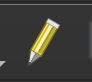

# Edit Existing Geometry

There may be cases where you want to edit the features of an existing vector GIS file. This tutorial was written to support a historic GIS project, where modern property boundary data will be edited to conform to historic boundaries. 

## Select the data

You can edit any vector GIS data you like, so long as it is in a file format that is supported by GIS Desktop Software like QGIS. 

::: tip Common GIS File Formats
To refresh or learn about vector file formats, check out our <a href ='./file-formats.html'>Common GIS File Formats Guide</a>.
:::

Exact steps for editing GIS data will differ depending on whether you are working with point, line or polygon features. This guide is written to edit polygon parcel boundaries. 

To download data for this tutorial, follow the steps in the <a href ='./mass-parcels.html'>Massachusetts Property Boundaries guide</a>.

## Edit the geometry

Once you have the polygon parcel data downloaded and opened in QGIS, you can start editing the shape of the features. 

To make the layer editable, turn on `Toggle Editing` by clicking the pencil icon in the main header toolbar. There are a *lot* of icons here, and the interface can be a bit unintuitive sometimes. The pencil icon is in the second row of the toolbars, a little bit from the left.

To move the polygon nodes, click the drop-down `Vertex Tool` and select `Vertex Tool > Current Layer`

You will now see red dots appear at all of the polygon `nodes`. A node is a place along the boundary of the feature that has existing x,y coordinates that you can graphically move around.

Editing the geometry of features within existing GIS vector files is an acquired skill. It takes a bit to get the hang of, and it is easy to mess something up. 

To revert changes, you can click `ctrl + Z` or `Edit > Undo`. You should probably save frequently, after every change you want to keep. By clicking the `Toggle Editing` pencil icon again, you will be prompted to save any changes that were made. 

::: tip Enable Topological Editing
This is an important feature. Under `Project > Snapping Options`, you will want to make sure that `Topological Editing` is enabled. This means when you move a node, it will drag the surrounding lines to the new location, instead of disconnecting the node from surrounding geometry.

The visual feedback in QGIS can be unclear sometimes (hey, it's a free tool), and it can be hard to tell if Topological Editing is turned on. If the button is darker, it is on, if it is lighter, it is off.
:::

## Edit the attributes

In the layer window, you can open the `Attribute Table` by right-clicking on the layer and selecting `Open Attribute Table`.

If the pencil is engaged, that is, `Toggle Editing` is turned on, you are able to edit values directly in the table. Similarly, you will want to save edits frequently. 

## Edit the field Names

To control the structure of the data behind the shapes, including the names of the header fields and the field types (String, Integer, etc.), right-click the layer in the layer window, and select `Properties`.

Choose the menu item `Fields`.

Here, if the pencil icon is engaged, and `Toggle Editing` is turned on, you are able to edit properties about the fields themselves. Here you can also use the menu to delete fields and add new fields. 

## Export changes

To ensure your edits are saved, you will want to export the data as a new dataset. This is a good rule of thumb when making any changes you want to be permanent in QGIS. 

Right-click the layer in the layer window and select `Export > Save Features As`. A dialog box will pop up, asking you to select file format, name, projection and location. The choices you make here will depend ultimately on what you want to do with your data. Generally, picking either `Shapefile`, `GeoPackage` or `GeoJSON` for the format, and defaulting to whatever coordinate system the original data was in should be fine for now. The good news, is you can always export your data again by following these steps, with more useful settings for whatever task is at hand.

## Tips and tricks

This guide is a good way to think about how you might want to get started editing geometry and attributes in QGIS, but much fuller documentation and tutorials exist describing all the myriad tools and functionalities QGIS has to offer. 

Check out <a target = "_blank" href ='https://docs.qgis.org/2.8/en/docs/user_manual/working_with_vector/editing_geometry_attributes.html'>The QGIS User Manual</a> for more complete information.

## Creating new layers

There may be cases where you want to create a new layer, completely from scratch, instead of editing a pre-existing data layer. To accomplish this, follow these steps:

1. `Layer > Create Layer > New GeoPackage Layer`

A dialog box will pop up asking you to name your database and table. You can choose whichever names make sense to you. 

::: tip File Naming Conventions
You can learn about how to name your files in the [File Naming Conventions guide](./file-naming.html).
:::

You will need to select the layer type: `point`, `line` or `polygon`.

Defaulting to WGS84 for the coordinate reference system is fine for now, but you will want to think about what projection works best for the goals of your project.

You can define the fields you want at the outset here, or do it later by editing the attribute table and field properties, as described elsewhere in this guide.

Be sure to save it somewhere you can find it.

Don't be too hard on yourself if this takes multiple goes to get it how you are imagining. Just like any skill, practice makes perfect.

More comprehensive documentation around creating new layers in QGIS is available here, in the <a target = "_blank" href ='https://docs.qgis.org/2.18/en/docs/user_manual/managing_data_source/create_layers.html'>Creating Layers QGIS User Manual</a>.

