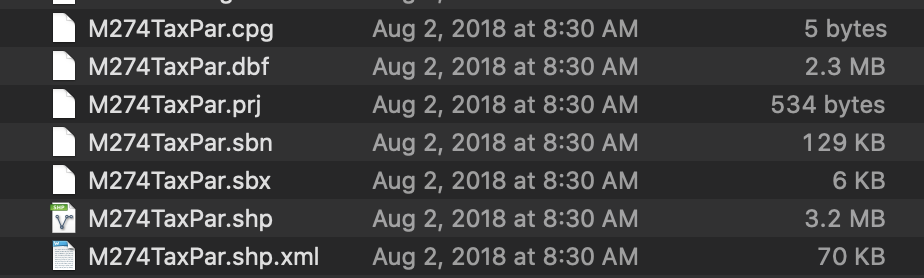

# Common GIS File Formats

This guide is meant to provide a few notes on common hang-ups related to popular formats of GIS data, and is not at all intended to be an exhaustive list or glossary.

## Shapefile

In your GIS data travels, you will certainly encounter Shapefiles. Shapefiles are a way of storing and displaying `vector` geographic information -- that is, <i>shapes</i> like points, lines and polygons. 

A shapefile will have features, for instance, a rivers shapefile would contain <i>line</i> features, and information about each feature, like the name, the length and so on. These features and <i>attributes</i> about each feature are all tied to and stored as real-life geography.

Shapefiles are technically a proprietary format -- they were invented in 1998 by the company ESRI. There are many reasons why shapefiles are so popular:
1. They have been around so long
2. Lots of people still use the commercial software ESRI, especially the agencies who are publishing and sharing data 
3. Shapefiles are interoperable with most geospatial software

This means that unlike some GIS data formats that only work in ESRI software, you can work with GIS data that is in shapefile format using a free desktop map editing software like QGIS. 

In fact, if you are looking for data to download, as opposed to online tools that only let you view the data, searching for the word "shapefile" can be a great way to find downloadable, editable versions of the vector data you are looking for.

Why are there so many files?

When you open a shapefile in your computer's file viewer, the shapefile will look like many different files. 

In the example above, all of the components pictured belong to the same shapefile. This can be really confusing to people just starting out with GIS. 

If you are interested in learning what all the different extensions are for, you can <a target = "_blank" href ='https://gisgeography.com/arcgis-shapefile-files-types-extensions/'>read more about it here.</a>

If you don't care why, and just want to work with the data, don't worry. When you bring the data into something like QGIS, all of the files will combine and appear as one singular layer. 

::: tip Bring a shapefile into QGIS
You can drag the file with the `.shp` extension directly into the QGIS map document, and the software will know to reference all of the other files behind the scenes. 

:::

## Geopackage

Other vector formats have been established as alternatives to shapefiles, like the `GeoPackage` (.gpx) that are effectively the same as the shapefile. Very heated discussions occur around which one to choose. For instance, find this blog about <a target = "_blank" href ='https://www.gis-blog.com/geopackage-vs-shapefile/'>why you should always use GeoPackage instead of Shapefile</a>.

## GeoJSON

At the Map Center, we like to store most of our vector information in `GeoJSON`. We do this because we do lots of web mapping at the LMEC, and GeoJSON is text-based, which means it is compatible with languages like JavaScript. It also displays exactly the same as a shapefile or geopackage would in QGIS or other desktop software. 

## Which one should I download?

If your data needs are to work with and edit vector information in a desktop tool like QGIS, you can understand shapefiles, geopackages, and GeoJSON as effectively interchangable. They are all common formats for storing point, line & polygon GIS information. They will all work in QGIS.

If you are having trouble navigating file formats, or think your needs might be a bit more particular, <a target = "_blank" href ='./resources/request.html'>drop us a line!</a>

