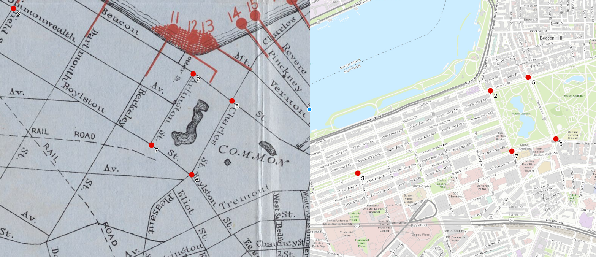

# Georeferencing

## Background Information

Georeferencing is the process of matching a digital cartographic image file to real-life geography by adding ground control points (GCP's).

A GCP is simply a point that the computer will use to associate pixel space in an image with geographic space in a modern web map.

For example, the screenshot below from a web georeferencing interface displays GCP's around the Boston Garden in red. The numbers associated with each GCP match the pixel space of a [scanned historic map](https://www.digitalcommonwealth.org/search/commonwealth:w3765q66z) (left) to the geographic space of a modern web map (right).

|
|:--:|
|*Image courtesy of Bert Spaan's [Allmaps editor](https://editor.allmaps.org/#/georeference?url=https%3A%2F%2Fwww.digitalcommonwealth.org%2Fsearch%2Fcommonwealth%3Aw3765q66z%2Fmanifest.json&image=P89G8PR8iGSTi87g)*

After sufficient GCP's have been added, a user can view the historic map overlaid in geographic space:

|
|:--:|
|*Image courtesy of [Allmaps viewer](https://viewer.allmaps.org/#type=annotation&data=data:text/x-url,https%3A%2F%2Fannotations.allmaps.org%2Fmanifests%2F7S4FRft8JVytyhg5)*

Most commonly, modern mapmakers and researchers georeference maps in one of two ways: first, by using a web platform, and second, by using desktop software (like QGIS).

## Georeferencing on the web

Georeferencing can be a challenging process to carry out on the web, because it requires the creation and storage of very large files called [GeoTIFFs](https://www.ogc.org/standards/geotiff). As such, many web georeferencers are costly proprietary softwares that aren't very accessible for everyday research use.

The Leventhal Map & Education Center (LMEC) is working with Bert Spaan to support his ongoing development of the [Allmaps platform](https://allmaps.org/) for web georeferencing. Using the [international image interoperabilty framework](https://iiif.io/) (IIIF) and [WebGL](https://www.khronos.org/webgl/), Allmaps makes it easy to georeference any IIIF-compliant map in a web browser.

Stay tuned for more information about how you can use Allmaps to georeference maps in the LMEC's collections, coming soon in **fall 2022**!

::: tip LMEC Map Warper
The LMEC Map Warper, previously used for georeferencing maps in our digital collections, is no longer being supported. You can learn about how to extract LMEC Digital Collections in geospatial formats from the <a href ='./lmec-dc-geo.html'>LMEC Georeferenced Collections Guide.</a>
:::

## Georeferencing in QGIS

The Leventhal Map & Education Center, which undertakes many digital humanities projects for which georeferencing is a core staple, currently carries out all georeferencing processes using QGIS. 

QGIS is a free desktop mapping software with a rich suite of functionalities. To get started with QGIS, please find the <a href ='./get-started-qgis/'>Get Started with QGIS Guide</a>.

Once you have QGIS installed on your computer, you can georeference any map by following this <a target = "_blank" href ='https://www.qgistutorials.com/en/docs/3/georeferencing_basics.html'>Georeferencing Basics Tutorial</a>.

All you need to start georeferencing is an image file of the map you wish to georeference. The Leventhal Map & Education Center and Boston Public Library make all of their digital collections available to patrons at their highest available resolution. 

To access high resolution downloads of our digitized map collections, navigate to the map you wish to georeference in our <a target = "_blank" href ='https://collections.leventhalmap.org/'>Digital Collections</a> and select `Download → Full Resolution, Uncompressed TIFF`

## Related Resources

- <a href ='atlascope-tool-guide.html'>Use the Atlascope Portal</a>
- <a href ='./atlascope-tiles.html'>Bring Atlascope Tiles into Your Map</a>
- <a href ='create-urban-atlas-data.html'>Geotransform Urban Atlases</a>

