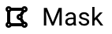

# Georeference Urban Atlases with Allmaps

::: warning LMEC-specific instructions

While we've made this documentation publicly available, please note that it contains **LMEC-specific instructions**, and may not be exactly replicable across institutions.

:::

This documentation contains step-by-step instructions on creating the underlying data sources for [Atlascope v2](https://atlascope.org), the Leventhal Center's tool for exploring historic urban atlases across Massachusetts.

There are many ways to georeference maps. Because we will be georeferencing online using [Allmaps Editor](https://editor.allmaps.org), there are no system or software requirements, **though it is recommended that you always use the most up-to-date web browser to avoid any buggy behavior**.

::: details What is georeferencing?

Georeferencing is the process of matching a scanned map its corresponding, real-life geography by adding ground control points (GCP's). Learn more at our [desktop georeferencing guide](../guides/georeference.md). Allmaps is a web georeferencing tool, powered by the International Image Interoperability Protocol (IIIF), that doesn't require any software installation. Learn more at our [Allmaps georeferencing guide](../guides/allmaps-iiif.md).

:::

::: details What are urban atlases?

Urban atlases captured fine-grained changes in the built environment of U.S. cities, particularly between about 1860 and 1940. Created by civil engineering firms like the Sanborn Map Company and G.W. Bromley & Co., urban atlases were primarily used to assess taxes or evaluate fire risk.

These large books, which usually mapped cities at the scale of an inch (on the map) to fifty feet (in the real world), were meant to be worked with on a daily basis and thus designed durably. The Leventhal Map & Education Center holds hundreds of atlases of towns and cities across the state of Massachusetts, many of which have been digitized but not georeferenced. While far from comprehensive, urban atlases represent an invaluable set of historic spatial data that lends itself to georeferencing.

:::

## Checklist & Table of Contents

::: details The software stack for this process

**Nothing needs to be downloaded!** You'll just need to have these websites open:

- [Allmaps Editor](https://editor.allmaps.org): mask and georeference atlas plates
- [Allmaps Viewer](https://viewer.allmaps.org): quality control 
- [Airtable](https://airtable.com): the single source of truth for managing georeferencing progress

:::

- [ ] [Step 1: Find your next atlas](#step-1-find-your-next-atlas)
- [ ] [Step 2: Load your atlas into Allmaps](#step-2-load-your-atlas-into-allmaps)
- [ ] [Step 3: Masking](#step-3-masking)
- [ ] [Step 4: Creating groud control points](#step-4-creating-ground-control-points)
- [ ] [Step 5: Inspection](#step-5-inspection)

## Step 1: Find your next atlas

The first step is to identify your **working atlas**.

At LMEC, we use the Airtable base [Atlascope Geotransformation Progress](https://airtable.com) as the single source of truth for progress in Atlascope georeferencing. You should consult with your supervisor before selecting your next working atlas.

::: tip Metadata in Airtable

All of the metadata in this Airtable base is populated by LMEC's running list of digitized atlases. Metadata fields (e.g., `barcode`, `geo_extent2`, `desc_short`) are not editable.

Throughout this documentation, the Airtable logo  will appear as a flag when it's time to update an Airtable data field.

:::

 Once you've selected an atlas, claim it by updating the `who_lmec` field with your username, and changing the `georef_status` field in Airtable to `in progress`.

## Step 2: Load your atlas into Allmaps

### Importing via manifest

<aside>

<h4>Mani-what?</h4>

A **manifest** is a document listing the cargo, passengers, and crew of a vessel (for example, a ship). **IIIF manifests** do exactly the same thing, but for items in digital collections—e.g., the IIIF manifest for an atlas identifies all of its individual plates.

</aside>

Once you've selected an atlas to work on, load it into Allmaps using its IIIF manifest. In this documentation, 11-sheet [atlas of Braintree and Weymouth as an example](https://collections.leventhalmap.org/search/commonwealth:j3862x39j), but feel free to follow along with any atlas you like.

To get started, simply copy and paste the IIIF manifest into Allmaps Editor input box. In LMEC collections, IIIF manifests are always an object's URL suffixed with `/manifest`.

For example,

```
https://collections.leventhalmap.org/search/commonwealth:j3862x39j
```

would become

```
https://collections.leventhalmap.org/search/commonwealth:j3862x39j/manifest
```

The atlas may take a minute to load, but once it has, you should see something like this:

|
|:---:|

## Step 3: Masking

### What is masking?

*Masking* is the process of identifying the part of a scanned image that you actually want to georeference. It usually involves drawing a polygon around any geographic material in a map. As you georeference atlases, there are two kinds of masking that you'll commonly encounter:

<aside>

**Note:** Cartographic accoutrement such as legends and scale bars are sort of a blurry space here. We mask them out for Atlascope, but in other cases, you may want to keep them.

</aside>

1. Masking to **remove non-geographic content, such as the margins of a page**. This kind of mask will be present on almost everything you georeference.
2. Masking to **partition a map containing distinct geographic areas which must be georeferenced separately**.

Since this atlas contains many sheets of front matter with no cartographic detail, like title and copyright pages, we don't need to worry about masking or georeferencing those.

To begin, click on the  button on the banner at the top of Allmaps Editor

Draw the mask polygon by clicking a point on the map. You can move an existing point by clicking, holding, and dragging. When you're done, you can double-click anywhere, or you can single-click on the first point in the polygon.

You should make one mask per distinct geographic area depicted in the atlas. Since this plate contains two areas, we'll make two masks.

|
|:---:|

::: tip Handling index maps

Like most atlases, this atlas contains an **index page** (image 6/11). When georeferencing for Atlascope, you often won't have to georeference the index map of an Atlas. You should only georeference part of an index map if it is of fairly large scale (e.g., between 50 feet:1 inch and 200 feet:1 inch).

This index page contains many map insets. Since some of them are large scale, such as the Lake View inset in the Town of Weymouth, we might choose to mask and georeference that, while choosing not to mask and georeference others for the purpose of Atlascope.

:::

Because this page has two inset maps, we made two masks.

---


---

### Best practices while masking

Generally, you should follow these two principles when masking atlas plates:
1. When possible, exclude non-cartographic data such as north arrows, legends, and blank spaces
2. Draw masks as closely as possible to the outermost cartographic data in the map

As you mask, consider the following:
1. If you were using Atlascope to conduct research in this area, what features would you want to be preserved?
2. Empty space on the *map* doesn't always mean empty space in the *territory*. There's was likely something there in real life, but it's not always easy to tell how this should impact your mask. If you aren't sure where to stop drawing your mask, check in with a colleague. 

#### Example
<br>


In this section of our [atlas of Braintree and Weymouth](https://collections.leventhalmap.org/book_viewer/commonwealth:j3862x39j#1/7), there was a lot of "empty space." We created a mask that followed the outermost cartographic data and excluded what "empty space" we could.

## Step 4: Creating ground control points (GCPs)

### What are GCPs?

**Ground control points (GCPs)** provide instructions for Allmaps to overlay the scanned atlas plate in the left-hand side of the screen upon a real geography in the right-hand side of the screen. To do so, identify a place that you can guarantee is the same in both sides of the screen—perhaps a street intersection that hasn't changed, or a building corner that's still there. Then click that point on both sides of the screen.

### Best practices for creating GCPs

To get started, click into the tab over to the  button in Allmaps. You should see a screen like this:


<aside>

**Check it out:** Read this [amazing essay](https://www.leventhalmap.org/articles/an-atlas-of-my-hometown-georeferencing-familiar-places/) from Ezra Acavedo, a former LMEC staff member and georeferencing whiz, for inspiration on georeferencing your hometown.

</aside>

1. **Avoid water bodies**—they change too much over time to trust for georeferencing
2. **Roads and buildings are useful**—as long as roads and buildings haven't been torn down or paved over, these are your safest bet for identifying a shared location between past and present
3. **Check your progress**—sometimes it only takes a few points to successfully georeference a map. Furthermore, adding too many points can actually *create* undesirable distortions in the warped image. As you georeference your map, check your progress along the way (for example, maybe at 5 GCPs and again at 10 GCPs)
4. **Add plate flags in the Airtable**—if you're unsure about or encounter any problems with an atlas plate, flag it for review in the `plate_flags` Airtable field

To check your progress, tab over to thebutton. You can either:
1. Right-click on `View current image` and select `Open link in new tab`
2. If on a Mac, hold down `⌘cmd` and click on `View current image`

This will open a new tab in **Allmaps Viewer**, a separate app in the Allmaps platform where you can view georeferenced plates.

As of this writing, Allmaps viewer is under development, leaving us with two options for checking our work.

### Observable notebook

Copy the IIIF manifest of your atlas—again, you access this by adding `/manifest` to the atlas's digital collection URL—and paste it into Bert's [Observable notebook for the Allmaps Tile Server](https://observablehq.com/@bertspaan/allmaps-tile-server).

The Observable notebook 

|
|:---:|

### Development Viewer

## Step 5: Inspection

As part of the quality control process, someone else should always check your georeferenced maps