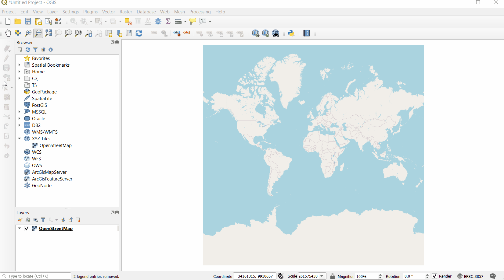
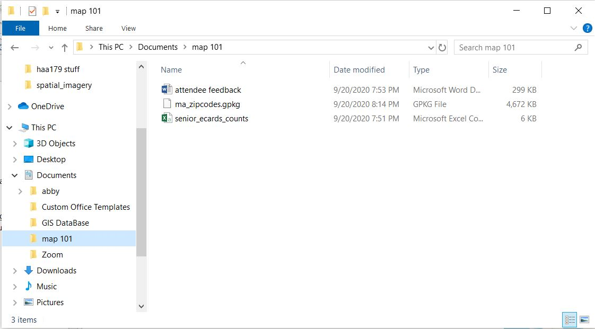
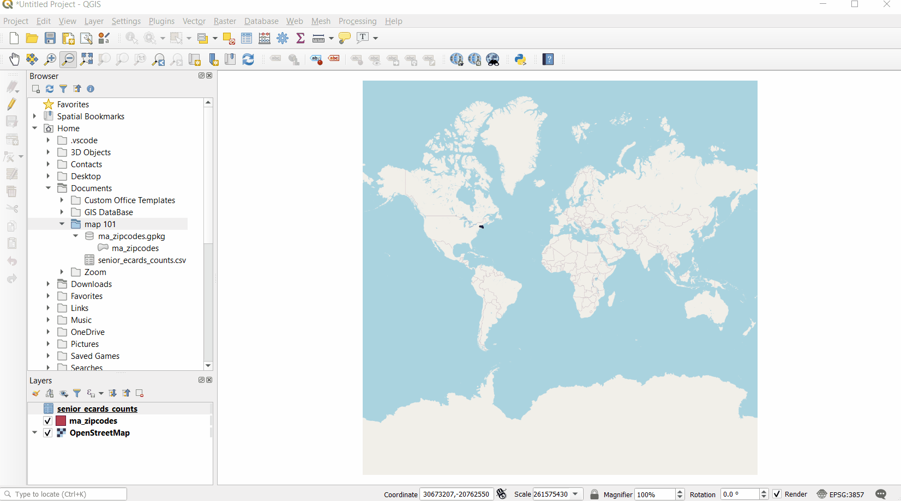
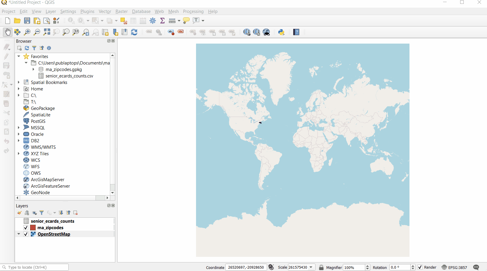

---

---

# Basic Tasks in QGIS

## Add a Basemap

Under `XYZ Tiles`, you can access URL-based **tiled web maps** to use in your project. These detailed maps can make great **basemaps** for your GIS project. A basemap is a background map layer that provides spatial reference for the project you are working on. Although it is not always necessary, a basemap can be helpful for orientation and interpretation as you create, edit, or analyze geographic data. 

For this exercise, we will use [OpenStreetMap (OSM)](https://www.openstreetmap.org/#map=4/38.01/-95.84) as our basemap. 

::: details Why OSM?
OSM is a free community-built open-source tiled world map that comes pre-loaded into QGIS. You can connect your `Browser` to other tiled web map services with more specific relevance to your project, for instance, if you are working on a project dealing with the natural environment, you may want a reference basemap showing elevation, but for referencing current streets and built-environment, OSM is a comprehensive and up-to-date choice.
:::

To add OSM to your project, navigate to `Browser > XYZ Tiles`, *right click* on `OpenStreetMap` in the dropdown, then select `Add Layer to project`.

OSM will appear in your **Map Canvas** as well as your **Layers List**.

::: tip 
Double-clicking will also add a layer to the project.
:::

## Add Data from your Device
From the `Browser`, you can also quickly access any files stored on your computer or an external storage device and add them to your QGIS project. 

To add data from your computer to your project, navigate to the relevant folder in your `Browser`, locate your files, and **double-click**. 

::: tip NOTE
The file tree in your `Browser` matches that of your device. However, *it will only display files that are compatible with QGIS*. This makes locating relevant data much easier. 

Here is a screenshot of the folder used in the above gif. Notice that the word document located in the folder did not appear in the QGIS browser.

:::

If there is a folder on your system that you will be using a lot of data from, you can add it to your `Favorites` in your `Browser` so its contents are easier to access. To do this, navigate to the folder as demonstrated above, right-click, then select `Add as a Favorite`. 

::: tip 
In the `Browser` you also have the ability to browse and open zip files directly.
:::

## Change the Coordinate System

The appearance of your map is based on the **coordinate reference system (CRS)** in which it is rendered. Because your computer screen is flat, any map you look at in a GIS will use a CRS to convert the spherical surface of the Earth to fit in the rectangular space of the **Map Canvas**. This process always involves distortion of size, shape, and distance. There are many different coordinate systems, and your choice will vary depending on the goals of your project. 

EPSG is a registry of spatial reference systems. Referring to a reference system's EPSG code is a common way to communicate that reference system with whatever software you are using. To search for EPSG codes based on locations, you can go to [EPSG.io](https://epsg.io/).

For the purposes of this demo, we will use **EPSG: 3585**, a coordinate system that accurately depicts the state of Massachusetts.

To change coordinate systems, find the **CRS button**  at the bottom-right of your map canvas and click on it. In the search bar at the top of the pop-up window, **type** in the name or number of your desired CRS, and then **select** that CRS from the options that appear. Finally, click `Apply` to apply this change and `OK` to exit out of the window.

Notice the change in the warp of the basemap.

::: warning
Troubleshooting the CRS of your data and map document is a common GIS frustration. If something isn't showing up as anticipated, there is likely a projection issue. Always verify that your project and all your data are in the desired coordinate system!
:::