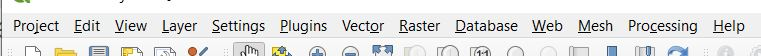
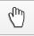
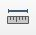
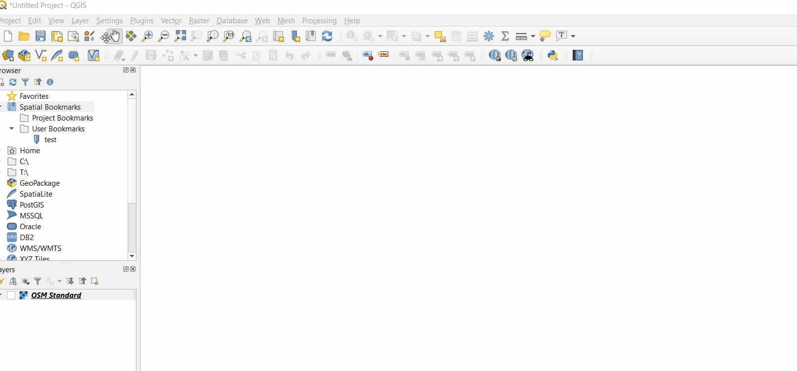
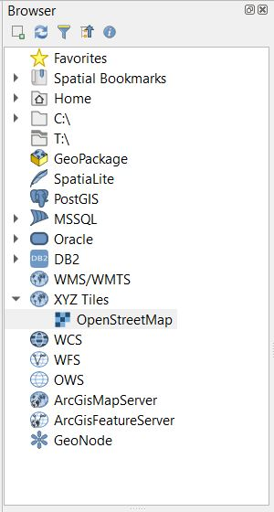
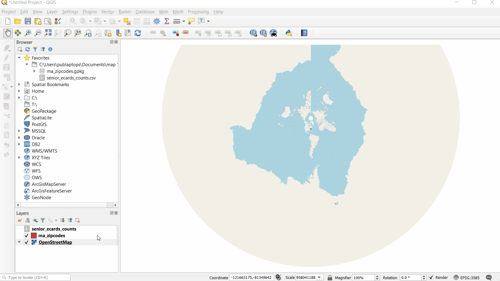
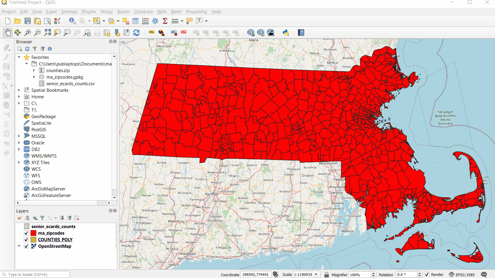

---

---

# Understanding the QGIS Interface

::: tip NOTE
The screenshots and gifs used in this guide were made on a Windows computer running on **QGIS 3.10.3**. If you are using a different version of the software or running it on a different operating system, your interface may look slightly different. Don't panic! If your version of QGIS is up-to-date (3.10 or later), you will have access to all the same buttons and functions. Older versions of QGIS will vary more greatly, but should still allow you to perform all the tasks in this guide.
:::

If you have QGIS installed and opened, you may be wondering "What do I do now?"

To open a new project, select the **New Project** icon in the top left of the window.

When opened in QGIS, your new document should look like this (minus the flashing labels).

These labels correspond to important functional components of your QGIS working document. From here, we'll show you how to understand and navigate these components and highlight some important common features located in each.

## Menu Bar

This bar holds the most basic functionality having to do with your current project. 

Under `Project`, you can **Open** a new or existing document, **Save** your current document, or **Export** it in a different file format compatible with a different software. 

Here you can also create a **Print Layout**, a map document formatted for presentation or inclusion in a report. For information about print layouts, see our [Create a Print Layout guide](../print-layout.html). 

Under `Layer`, you can use the `Data Source Manager` to **Add Data** to your map project. This data can take the form of vector data, raster data, data tables, and more. For more information on the types of data compatible with QGIS, see our [Common GIS File Formats guide](../file-formats.html).

Under `Plugins`, you can access plugins that will allow you to perform initial tasks beyond QGIS's core functionality. Like QGIS itself, plugins are coded open source by developers, and are available for free. For many common tasks, such as **Georeferencing** and **Geocoding**, installing or enabling an appropriate plugin is necessary.

## Toolbars

Towards the top of the QGIS interface is a customisable area where various **Toolbars** are found. A wide variety of tools can be found here, including the most universally used tools, the **Navigation Tools**.

The **Pan Tool**  allows you to pan across your map document.

The **Zoom Tools**  will allow you to zoom in and out of your map. You can also zoom by using the scroll wheel on your mouse.

::: tip Understanding Your Mouse
The way your mouse and trackpad actions correspond to QGIS functionalities will change depending on the tool you have selected. This may seem a little obvious, but being aware of this can prevent confusion. 
For example, if you are using the **Zoom Tools**, clicking the document will zoom the interface in and out. If you are using **Measure Line Tool**, however, each click will create connected vertices that QGIS will measure. 
:::

Tools are grouped into toolbars according to collections of tasks relevant to particular kinds of projects. Depending on what you're working on, you will use some tools more than others, and you may not need some at all. The toolbars are easily customizable using this icon , as demonstrated in the gif below:

You can toggle toolbars on and off through the **Menu Bar** by navigating to `View > Toolbars` and then checking or unchecking the available toolbars according to your preference.

## Browser Panel

The **Browser Panel** allows you to easily pull pre-existing data into your QGIS project. This panel connects to your computer, storage devices, common geographic databases and networks, and allows you to access QGIS-compatible files and tiled maps that you may want to use.

If you're new to GIS, don't be intimidated by all the unfamiliar options listed here. The majority of these (SpatialLite, Oracle, PostGIS, MSSQL, etc.) are databases that hold different types of geographic data or information. You won't need to be familiar with them just yet.  

## Map Canvas
The **Map Canvas** is where the visual aspect of your mapping data comes to life. Try it out by navigating around the basemap using the **Pan Tool**, the **Zoom Tool**, and others discussed above.

## Layers List

The **Layers List** is the final basic component of the QGIS interface. Here you will find all data layers that have been added to your project. 

&nbsp;

&nbsp;

**Zoom** to the geographic extent of a layer, by right-clicking on it and selecting `Zoom to Layer`.

**Rearrange** layers by dragging and dropping them in the list.

**Toggle** layers on and off using the check-box to the left of the layer name. 
 

::: tip NOTE
QGIS can support data that does not contain any spatial components. This data can be processed, operated on, or combined with spatial data in the software. Tabular data loaded into the QGIS will appear in the **Layers List** but not in the **Map Canvas**.
:::

Now that you understand the basics of the QGIS interface, see [our other guides](../) to learn how to perform specific tasks in QGIS.