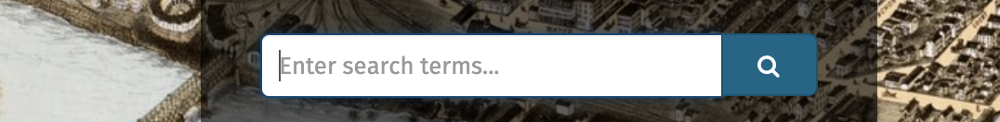

# Georeferenced Map Collections

## A note on Map Warper 
The Map Warper integration which was set up in our Digital Collections site is unfortunately no longer being supported. The source Map Warper software this was based on, and the crowdsourced add-on to the original software requires many outdated dependencies that make the tool's upkeep extremely difficult and less-than-operational.

We apologize for the inconvenience.

## Accessing maps georeferenced in Map Warper
You can access maps which were georeferenced using our Collections portal instance of Map Warper prior to the software's expiration by doing the following:

1. Visit <a target = "_blank" href ='https://www.collections.leventhalmap.org'>collections.leventhalmap.org</a>
2. Return all map results by clicking the blue search button on the home page

3. Filter by only the maps that have been georeferenced. Do this by scrolling down the filters on the left hand side of the page, and selecting `Georeferenced → Yes `
4. Pick a map from the resulting list
5. On the page showing the map, scroll below the map image to the `Downloads` section
6. To download a GeoTIFF for use with GIS software, select `Downloads → GeoTIFF` 
7. To find a web layer link that will be compatible in QGIS, ArcGIS Online, Leaflet, and so on, select `Downloads → See More Downloads (Warped PNG, KML, WMS Tile URL) → Tiles (Google/OSM Scheme)` 

