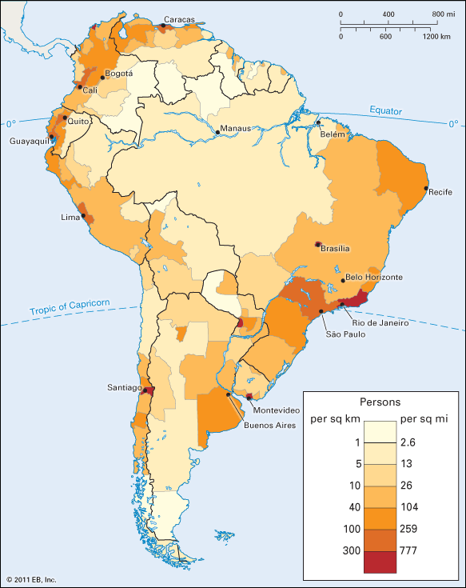

# Introducing geospatial data

<aside>

For more information, check out Cosgrove's [Geography and Vision: Seeing, Imagining and Representing the World](https://bpl.bibliocommons.com/item/show/1509628075), the chapter called "Moving Maps."

</aside>

* Geographer Denis Cosgrove has described maps as an instrument, like the microscope or telescope, that “allows us to see at scales impossible for the naked eye.
* He said that maps “reveal the presence of phenomena that are beyond our normal bodily senses.”

## Types of maps

<aside>

**Consider this:** Can you think of examples of reference maps that you use in your everyday life? Are there specific places or contexts where you might see thematic maps?  

</aside>

* **Reference maps** specify locations of physical features such as coastlines, roads, rivers, cities, mountain ranges, or coffee shops. Examples of reference maps include atlases, road maps, globes, and Google Maps.
* **Thematic maps** show us trends across space, which are otherwise invisible, such as distribution of household income, annual rainfall, population density, or air quality.

<figure>

<figcaption>

A reference map of South America showing country borders and locations of cities, [National Geographic](https://media.nationalgeographic.org/assets/photos/000/289/28906.jpg)(2009).

</figcaption>
</figure>

<figure>

<figcaption>

A map showing the population density across South America is an example of a thematic map, because it shows a specific theme—in this case, population density, [Britannica](https://kids.britannica.com/students/assembly/view/160672).

</figcaption>
</figure>

* Both kinds of map rely on and represent data.
* In this course, we focus on the creation of thematic maps because they show us how to work with *both spatial and non-spatial data*.

<hideable title = "Literature's absurdist map">

In 1893, long before the advent of mapping software, Lewis Carroll summarized many of the fundamental troubles faced by contemporary mapmakers. In his book *Sylvie and Bruno Concluded*, he describes a conversation between the narrator and a German man, Mein Herr:

> “What a useful thing a pocket-map is!” I remarked.
>
> “That’s another thing we’ve learned from your Nation,” said Mein Herr, “map-making. But we’ve carried it much further than you. What do you consider the largest map that would be really useful?”
>
> “About six inches to the mile.”
>
> “Only six inches!” exclaimed Mein Herr. “We very soon got to six yards to the mile. Then we tried a hundred yards to the mile. And then came the grandest idea of all! We actually made a map of the country, on the scale of a mile to the mile!”
>
> “Have you used it much?” I enquired.
>
> “It has never been spread out, yet,” said Mein Herr: “the farmers objected: they said it would cover the whole country, and shut out the sunlight!”

You might be thinking, “That’s absurd!” (*Sylvie and Bruno Concluded* is indeed billed as a comedy.) But the absurd comedy of Mein Herr’s one-mile-to-one-mile map exposes one of many assumptions we have about maps: that they are smaller than the space they are representing. We know already, then, that a map is an abstraction of the world. It is a simplification, a representation, a “[scaled model of reality.](https://projecteuclid.org/euclid.ss/1124891287)” Maps are not supposed to be reality itself—which is why Mein Herr’s map is so preposterous.

Carroll's absurdist map was the basis for a short story by Argentine writer, Jorge Luis Borges. In "On Exactitude in Science," Borges tells a tale of a civilization that mapped its territory in a one-to-one scale. Decades later, the map lies in tatters across the landscape. The story can be read in its entirety [here](http://www.blc.arizona.edu/courses/schaffer/182h/On%20Exactitude%20in%20Science.pdf). For a critical take on these two stories, and a telling of the modern state of mapping, check out this [New Yorker article](https://www.newyorker.com/books/page-turner/the-allure-of-the-map).

Making a map is a long process of abstraction, translation, and communication. That abstraction begins in the collection of data and continues through the production of the map itselfs.

</hideable>

<Quizlet
    title="Check your understanding"    
    :questions="[
        {text: 'What kind of map would you use to figure out where the border of Boston lies?',
        answers: [
            {text: 'Reference map', correct: true},
            {text: 'Thematic map'}
        ]},
        {text: 'What kind of map would you use to figure out which neighborhood of Boston has the most Vietnamese immigrants?',
        answers: [
            {text: 'Reference map'},
            {text: 'Thematic map', correct: true}
        ]
        }
    ]"
></Quizlet>
