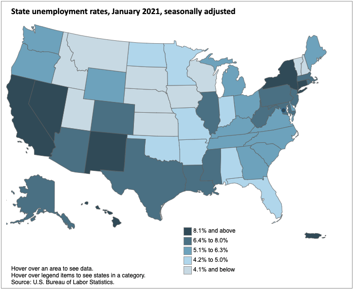

# Attribute data

## Types of attribute data

* **Review: Attribute data tell us “what” is happening.**
    * This kind of data describes things like household income, air quality, or unemployment rates.
* For attribute data to be legible to computers, we have to store it in highly structured forms that computers can understand. We can call this "machine readability."
* The two most basic of these forms are **strings** and **numbers**
    * **Strings** are combinations of letters: humans can read strings as words or codes
        * The word `high`, the name `Back Bay`, and the code `BOS0001` are all examples of strings.
    * **Numbers** record countable observations and values.
        * Numbers, in turn, might have different forms, like counts, fractions, or percentages
        * For the most part, a computer can only understand "plain" numbers: **integers** and **decimals**. A percentage sign would trick a computer into thinking that it's looking at a **string**, so it's better to use `0.56` rather than `56%`

## "Seeing" a map's attributes

* Take a look at this map of unemployment rates
* Here, the data is visualized as shades of blue

<!---
Where does this map come from?

-->

<figure>

<figcaption>

Local Area Unemployment Statistics Map, [U.S. Bureau of Labor Statistics]( https://www.bls.gov/charts/state-employment-and-unemployment/state-unemployment-rates-map.htm#)(January 2021).

</figcaption>

</figure>

######

* But what does the computer actually "see"?
* Here is the **attribute table** that created this map presented in spreadsheet form:

<figure>

<figcaption>

Attribute table associated with the unemployment map. [Bureau of Labor Statistics]( https://www.bls.gov/charts/state-employment-and-unemployment/state-unemployment-rates-map.htm#) (2021). 

</figcaption>

</figure>

<Quizlet
	title="Check yourself"
	:questions="[
		{text: 'In this attribute table, what kind of data is in the State column?',
		answers: [{
		text: 'String',
		correct: true
		},
		{
		text: 'Number'
		},
		{
		text: 'Geometry'
    }]},
    {text: 'In this attribute table, what kind of data is in the November 2020 column?',
		answers: [{
		text: 'String',
		},
		{
		text: 'Number',
		correct: true
		},
		{
		text: 'Geometry'
    }]}
	]"
/>
