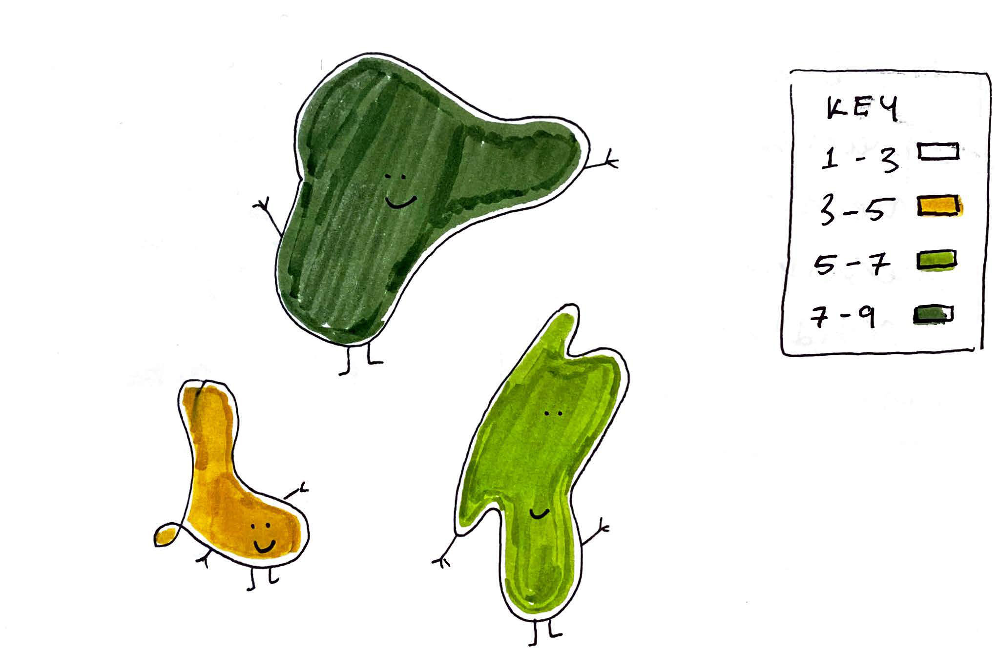

# Joining feature and attribute data

## How do features and attributes get together?

* Most data maps show both the shape and location of places (**features**) and information that we know about those places (**attributes**)
* How do we connect these two different types of data?
* Merging features and attributes typically requires connecting data sets through a process called a **join**
* To join two or more sets of data, we need something called **stable identifier** or **unique identifier**
    * A stable identifier is shared by the feature and attribute data and tells the computer which data corresponds to what geographical place.

<figure>

<figcaption>

A drawing showing how attributes (the numbers) and features (the empty shapes) are joined together. The dotted lines represent the "stable identifier" that links the two data, Tess McCann (2021). 

</figcaption>

</figure>

## An example join

Looking at the attribute table for the Wi-Fi maps we have discussed, we can see how joins work:

* Each row of attribute data has a value called `GEO_ID`.

<figure>

<figcaption>

An attribute table with information on internet access.

</figcaption>

</figure>

* The feature data (which contains the shape of each Census tract) also has a `GEO_ID` value.
* Derived from [FIPS codes](https://www.census.gov/library/reference/code-lists/ansi.html), the GEO_ID is the **stable identifier** that we use to link the information about internet access with information about the shapes of Census tracts.
* The GEO_ID field is uniquely suited to be the stable identifier: it serves one purpose and is not likely to be misinterpreted as attribute data.
* When we join attribute data to feature data, we tell the computer to fill the shape of the feature data (a polygon, a point, a line, or a grid square of a raster file) with the information in a certain row of the attribute data.

<figure>

<figcaption>

A map showing the Geo_ID of a feature from the Wi-Fi dataset, LMEC (2021).

</figcaption>

</figure>

::: tip

To join data, the identifiers need to be **exactly** the same as one another. An extra space, capitalization and even other symbols are all reasons the computer might fail to complete a join.

:::

<hideable title = "Styling feature data">

In [Session 1](./session-1/part-5.html#the-human-role-in-mapping-from-data-to-maps), we discussed how the **cartographer** makes choices about bucketing data and assigning each of those buckets a color. This process is often called **styling** a map. To do this sort of work, the feature data has to be joined with attribute data—the colors that are assigned to each shape are determined by the numerical value associated with that shape. Put another way, the computer cannot simply be told "this shape should be colored green." Rather, it has to be told that "shapes that have a value within this range should be colored green." 

<figure>

<figcaption>

An illustration of styling feature data through its attributes, Tess McCann (2021.

</figcaption>

</figure>

Chloropleth styling—which assigns colors based on a range of values—can only occur when the geographic feature, the shapes, are first assigned values through a **join**. 

</hideable>

<Quizlet
	title="Comprehension check"
	:questions="[
		{text: 'You have some feature data of states where each state is defined by its abbrevation (e.g., MA). You also have an attribute table where each state is defined by its name (e.g., Massachusetts). Could we join these two data sets in their current format?',
		answers: [
			{text: 'Yes'},
			{text: 'No', correct: true}
		]}
	]"
/>
