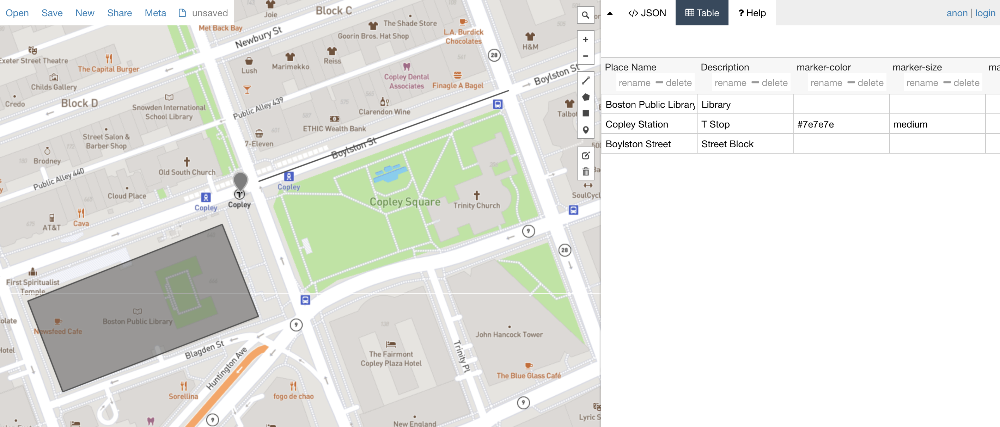

# Exercise: Creating and updating geospatial data

## Drawing geospatial features in geoJSON.io

* [geoJSON.io](https://geojson.io/#map=2/20.0/0.0) is an online platform where you can view geospatial data
* In this exercise, we will create our own geospatial data by drawing vector features (points, lines, or polygons) on the map, and populating the attribute table for these features.
* Ideas for data you can draw: parks in Boston; neighborhoods; points of interest. For this exercise, don't pick something too geometrically complicated.
* You could even try to recreate the map you hand-drew in Session 1!

