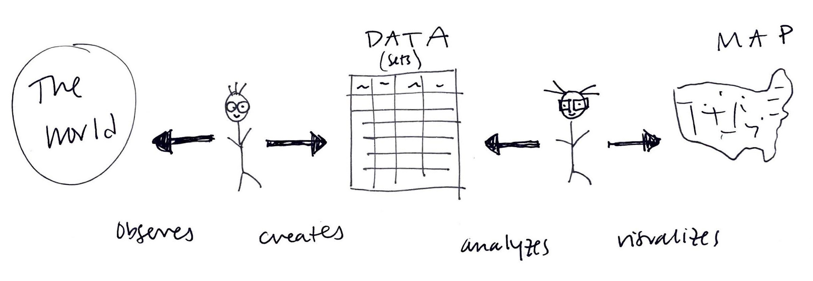

# Concluding thoughts

## Human bias in data

* Humans are present at every stage of the data and mapping process: humans observe the world and structure the observations into **data**; humans interpret this data and visualize it into maps. 

<figure>

<figcaption>

An illustration showing the human role in the data and mapping process, Tess McCann (2021).

</figcaption>

</figure>

* Because there are humans at every step of the way, human biases can seep into data and into maps (recall the two Wi-Fi accessibility maps from Session 1!) 

<aside>

**Real-world example:** Covid-19 testing capacity. Early in the pandemic, a lack of testing infrastructure clouded our understanding of community spread and transmission. Fluctuations in testing capacity and infrastructure affected the accuracy of the data.

</aside>

* Humans bias and distortion actually begins much earlier than that—with the collection and structuring of data. 
  * What gets lost in translation between spreadsheet and map?
  * Some helpful vocabulary for identifying this distortion:
    * **Response bias**
    * **Sample size**
    * **Survey design (e.g. leading questions)**
    * **Missing data**
      * i.e. the information that we fail to record  (more to come in Session 3!)

* Any mode of data collection is imperfect; it is an attempt to record phenomena in our world. Being aware of these imperfections is the key! 
