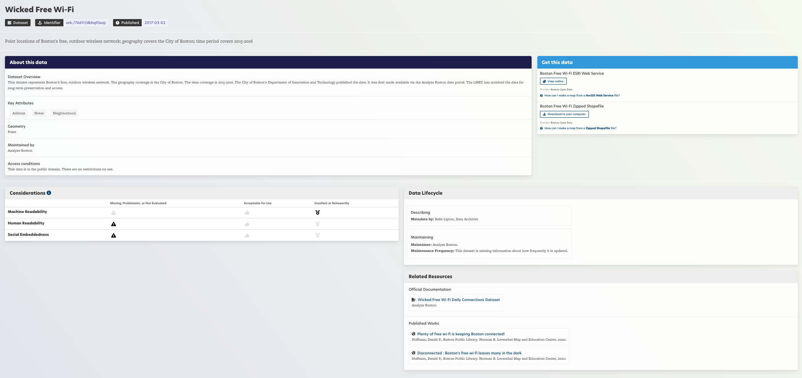

# Metadata on the LMEC Public Data Portal

You can find detailed metadata in the LMEC Public Data Portal. We will walk through how to understand this information using the Internet Access & Connectivity dataset as an example.

### About this data

* The "About this data" section of the page includes an overview or description of the dataset including:
    - What **topics or themes** does the dataset address?
    - What **time period** does the dataset cover?
    - **Where** in the world does the dataset represent?
        - *Many, but not all, are of Boston!*
    - **Who** originally collected and cleaned the dataset?
    - **Why is it archived** in the LMEC portal?
* As well as other basic descriptive information like the **key attributes** and **access conditions**.

### The data lifecycle
* The data lifecycle tells you where and how people have worked with, changed or edited the data
* This section provides links to the records of those who have worked with data, describing, in their own words, their steps and choices
* You will not find this in most data portals, but we think it is important to preserve
* You can use this section to understand how the data has been shaped, and by whom
* You can also use this section to repeat the steps of the original data processor

### "Data Considerations""

* This section shows an evaluation of the dataset *and its metadata* by LMEC Data Archivist Belle Lipton.

* These evaluations aim to understand how easily read the data is by both a human and a computer.
    * Human readability: Is the dataset well documented? Can a human easily reproduce this data and understand the processing steps?
    * Machine readability: Is the dataset available in ready to use formats?
* Social embeddedness: How well is the social context in which the data was collected preserved?
* It is important to factor these considerations in every dataset we come across and in the cases where this information is not available, why might that be the reason?

### "Related Resources""

* This sections covers other published works related to this data along with codebooks for how fields may have been modified in the production of this dataset.
* Considering how once dataset or project relates to others is a key skill in making broader connections across works and forming narratives from data!

### Data transparency

* **Data transparency** applies not only to maps—"where does the data on that map come from"—but also to the data itself.
* Both data and metadata needs to be looked at through the lens of transparency!
* As critical viewers of data you should begin to prioritize and value ethical data transparency in order to make fair choices about what can and cannot be said from a given dataset.

## Check for Understanding

##### Wicked Free Wi-Fi, a dataset from the City of Boston on Public Wifi Spots

<Quizlet
    title="Check your understanding"
    :questions="[
        {
            text: 'Considering the dataset above, what metadata not present would make the dataset more transparent? Choose all that apply.',
            answers: [
            {text: 'The timeframe in which the data was collected' },
            {text: 'How the cartographer worked with the data', correct: true},
            {text: 'The name of the dataset'},
            {text: 'Forseen limitations of using the datset', correct: true}
        ]},

        {text: 'Once collected, data is not altered by humans in any form.',
        answers: [
            {text: 'True'},
            {text: 'False',correct: true}
        ]
        },

         {text: 'In mapping internet access in Boston, which of the following does the metadata help you understand?',
        answers: [
            {text: 'Which organization collected this data', correct:true},
            {text: 'Internet Access in southern Massachusetts'},
            {text: 'The quality of the WiFi offered'}
        ]
        }
    ]"
/>
