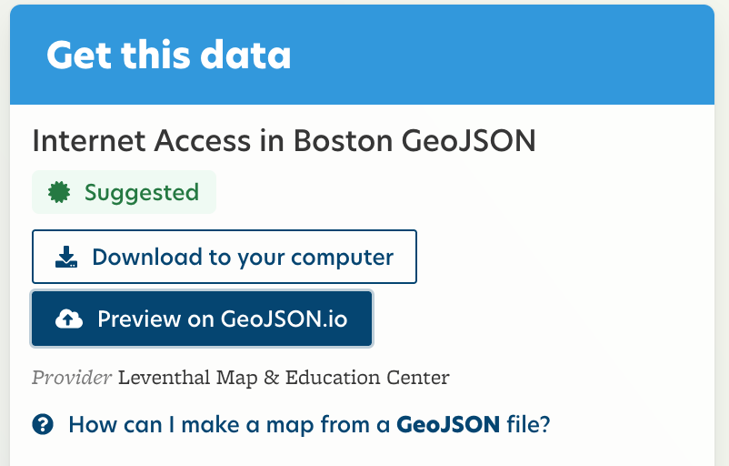
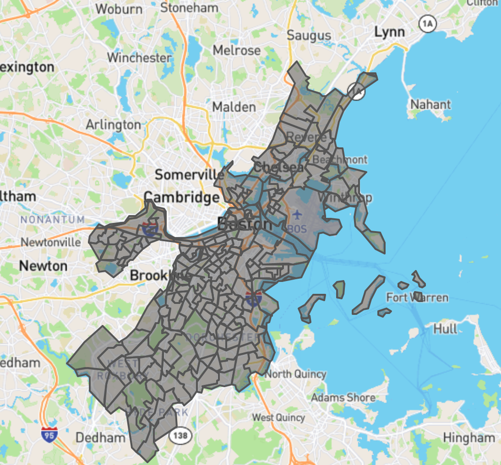

# In Class Exercise: geojson.io

## Inspecting Data in geoJSON.io

* After navigating to *Preview on GeoJSON.io* from the LMEC data portal, here are some key points to note
  * The left map showcases the spatial features of the dataset. Click on any polygon to learn more about a particular feature. The pop up window show information on how the shape is displayed and the attribute data for the given polygon.
  * The right hand map showcases the attribute data of the dataset.
    * **JSON tab**: A computer readable version of the dataset - essentially a long list of all the polygons that make up the entire dataset. Each polygon has its own information including attributes and geometric instructions for how to represent this shape in points.
    * **Table tab**: A more human friendly representation of the attribute data. Each row represents one polygon and each column represents one field. Click on a particular cell to see which feature it points to.
* *Note* All of the data is editable! If you do make changes remember to document your process for future users of the data.

## Finding Data (5 minutes)
**Now, using the critical data skills we have been developing, go find a dataset out in the wild!**
* Try to find a spatial data file—specifically a GeoJSON—on any topic that interests you about Boston.
  * If you're not sure where to look, try looking at [Data.gov](https://catalog.data.gov/dataset?res_format=GeoJSON&_res_format_limit=0) filtered by GeoJSON as an example.
* Make note of what metadata you are seeing for you dataset and keep that in mind.
* Save that dataset somewhere you can easily navigate to it on your computer.

## Looking at Spatial Data (10 minutes)

* Navigate to the Internet Access Data Set on the open data portal by using this [link](https://lmec-data-portal-dev.netlify.app/#/catalog/dkhm2yhrb).
* Click on the button on the right labelled *Preview on GeoJSON.io*
* Navigate to geojson.io in an internet browser on your computer.
* Bring this GeoJSON file you downloaded into geojson.io by navigating to Open -> File and then locate the file. Notice what appears.
* Bring in your other dataset that you found by navigating to Open -> File and then locate the file.
* Compare what's different about the two datasets. What regions does it cover? Are there any patterns that you can tell by looking at the data.

<aside>
geojson.io is a great free online tool to be able to view your datasets however there are many out there! Other options include Carto, ArcGIS Online and QGIS which range in technical level. Anything involving GIS should be able to do what you need for your projects.
</aside>

## Discussion Questions
* How was the data finding process? What did you notice about the metadata available on sites you visited?
* What surprised you when seeing the data visualized on geoJSON?
* What patterns do you think you can conclude from this data?
