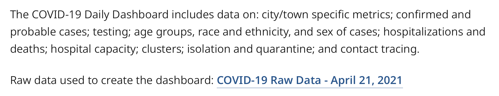

# Putting it all together: Messy data exploration

* For a real-life example of dealing with messy data, we're going to use a very important contemporary data set: **COVID-19 reporting in Massachusetts**.

## Finding the data in context

* [This website](https://www.mass.gov/info-details/covid-19-response-reporting) is where the State of Massachusetts makes its public COVID-19 data sets available.
    * Spend some time looking at this site to see what kind of contextual data is available. Who is generating this data? How do we know that it is accurate?
* If we wanted to make a map of COVID cases by town, we'd want to access the "Raw Data." Here's what that link looks like: 

* But if you click that link, you're not on a map page or a metadata page. You've just downloaded an Excel file to your computer, maybe without even realizing it!
    * To simplify this exercise, we've copied this file to our cloud drive so that you can look at it in your browser. See it in [Excel Online by clicking here](https://bostonpubliclibrary.sharepoint.com/:x:/s/LeventhalMap/EZTiokPVlm9Hu04uHaJTOdkBx_hSLixOlLH60667s-vrTw?e=Bf8h6O).

## Finding the map diamond in the data rough

* This Excel spreadsheet is a pretty good example of the very messy data sets that you're likely to find "in the wild"
* Spend some time clicking around the file together to see if you can find:
    * Which tab helps you understand what is going on in this document?
    * Which tab or tabs might be most useful in making a map of COVID cases?

## Putting together what you know

* Once you've made it to the tab `Weekly_City_Town`, you'll find yourself with some information that seems like it relates to geography
    * This workbook has 5985 rows. But Massachusetts only has 351 cities and towns! What do you think is going on here?
    * What *attributes* from this data do you think might be useful for making a map?
    * Can you see any problems with the data that might confuse mapmaking software?
    * What would you need to do in order to relate the `City/Town` column to a shape on a map?

