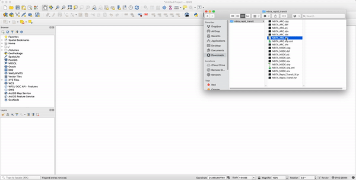
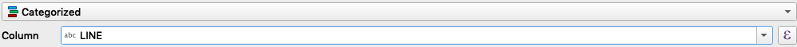
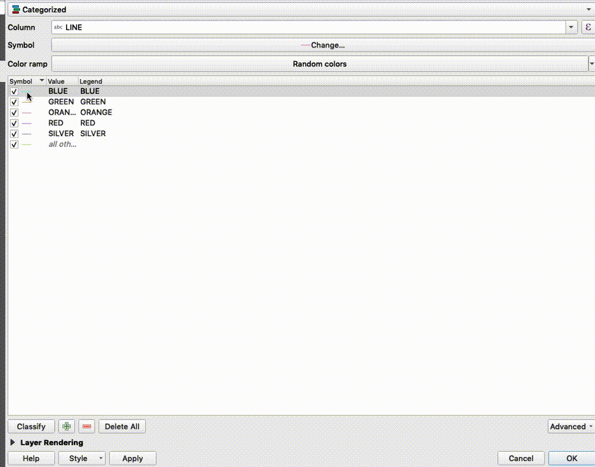
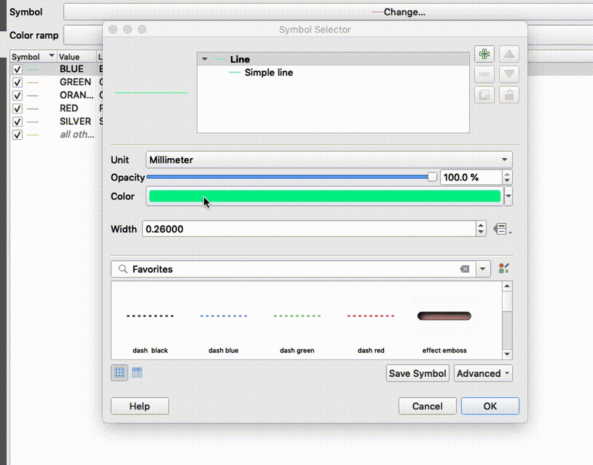
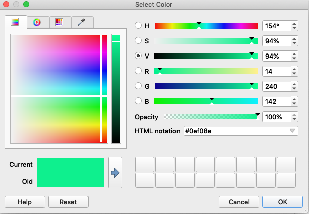
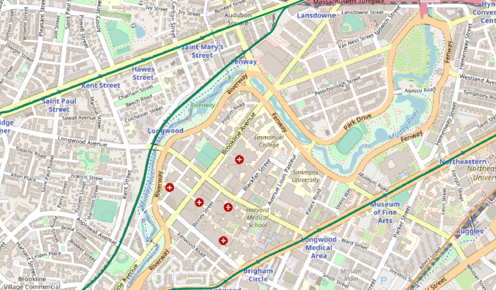

# Symbolize by Value

In this tutorial, we will learn how to change the style of data features based on their stored attribute characteristics.
We will be working with MBTA subway rail lines to change the color of each line, depending on how each line feature is categorized.

## Get the data

We will be working with the MBTA Rapid Transit Data, made available by MassGIS.

You can [download the data here.](https://www.mass.gov/info-details/massgis-data-mbta-rapid-transit "download the data here.")

::: tip How to Download
Scroll down<br>
Select `Download this data`
:::

This data is made available as multiple `shapefiles` zipped up into a compressed folder. You will have to unzip or uncompress the folder in order to access the data.

To learn more about different GIS file formats, please find our [Common GIS File Formats guide.](./file-formats.html#shapefile "common GIS file formats guide.")

## Bring the data into QGIS

If you do not already have QGIS, you will need to download the free software first. To learn how to download and use QGIS, please find the [Get Started with QGIS guide.](./get-started-qgis/#what-is-qgis "getting started with QGIS guide.")

Once you have a new QGIS project open, you can add the data to the project by selecting `Layer > Add Layer > Add Vector Layer`

Under `Source > Vector Dataset(s)` click the elipses `Browse button` to pull up the data browser.

Navigate to where you have downloaded and unzipped the data, and select the file named `MBTA_ARC.shp`

Select `Open`

Select `Add`

::: tip Drag and drop
You can also add the shapefile by simple dragging the file `MBTA_ARC.shp` from your file finder into the **Map Canvas**. Try it out!

:::

## Inspect the data

When you first bring the data into QGIS, all of the lines appear to be the same color. There are values stored within the data about each line feature, giving us information about which subway line each feature is associated with. We can use these feature attribute values to apply symbology uniformly to the features on the map.


In the `Layers` window, right-click on the MBTA_ARC layer

In the options that appear upon right-click, select `Open Attribute Table`

Here, we are presented with a table of values in which each record corresponds to a line segment on the map. Each record has a value for its associated MBTA line. This `LINE` field, is the field we will use to symbolize the map.

You can close out of the Attribute table by clicking the red x in the top left corner of the window.

## Change the symbology method

In the `Layers` window, right-click on the MBTA_ARC layer

Select `Properties`

Select `Symbology`

At the very top of the symbology window, there is a drop-down menu where the default value is `Single Symbol`

::: warning
This drop down can be easy to miss!
:::

Instead of symbolyzing every feature with one single color, we wish to symbolize them based on the subway line category they are grouped into.

Click the drop down that says `Single Symbol` and change to the menu option `Categorized`

Now we have told QGIS that we want to symbolize based on categories. Next, we have to tell QGIS *which* category to symbolize on.

In the next drop down, titled `Column`, click the down arrow on the menu, and select the field `LINE`

The top of your symbology window should now look like this:



Towards the bottom of the symbology window, there is a button labeled classify. Click the `Classify` button.

Now we will be able to edit each separate category of data within the field `LINE`

## Update symbology

Next, we will go through each subway line, and update its symbol.

Double-click the small line to the left of the word `BLUE`



A new window will pop up, allowing us to edit the symbology of all features categorized as being associated with the MBTA Blue line.

Click on the menu drop-down labeled `Color`





Under `HMTL Notation` replace the current value with the following hex color value

**Blue:**
```
#007AB0
```

Press `OK`

Let's also make the lines thicker.

In the menu labeled `Width`, replace the current value by typing in `1.5`.

Press `OK`

Repeat the same process for all of the different subway lines.

**Red:**
```
#DA484C
```

**Green:**
```
#008B60
```

**Orange:**
```
#E7A15F
```

**Silver:**
```
#8B8C86
```

When you are done with all the categories, select `OK`


The lines should now be appearing on the map with the proper colors.

You can now use this data alongside other data, or [add a basemap for reference.](./guides/get-started-qgis/basics.html#add-a-basemap "add a basemap for reference.")





Use our [GIS Research Services](https://www.leventhalmap.org/research/geospatial/ "GIS Research Services") for free, one-on-one help finding and using GIS data.
