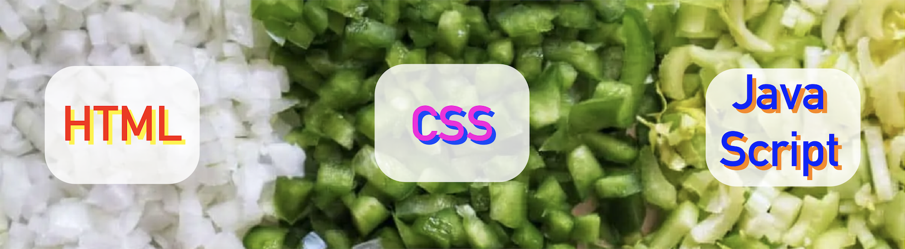

# The holy trinity

|
|:---:|
|The holy trinity ([source](https://www.redbeansanderic.com/what-is-the-holy-trinity-of-creole-and-cajun-cooking/))

## HTML: the core ingredients

Every dish has core ingredients that comprise its foundation. Think the veggies in your stew, or the eggs in your frittata. Without these structural ingredients, your dish would hardly be a dish at all.

<aside>

**Note**: HTML documents have a file extension of `.html` and are usually named `index.html` by convention.

</aside>

[Hypertext Markup Language](https://en.wikipedia.org/wiki/HTML), or HTML, is a programming language designed to provide web pages with structure and content. HTML provides the core ingredients to a web page, including text, images, and—eventually—interactive maps!

HTML syntax is organized around **elements**, or lines of code defined by a **start tag** `<tagname>` and an **end tag** `</tagname>`. There are many kinds of elements, for example:

- the `<section>` element defines page sections
- the `<h1>` element defines a large header
- the `<p>` element defines a new paragraph
- the `<body>` element defines all content in an HTML document

Put together, this looks like:

```html
<section>
  <h1>Your delicious web map!</h1>
  <p>This code will serve as the building blocks of your web map.</p>
</section>
```

## CSS: the spice cabinet

Should your soup be more sweet or more savory? How much cayenne pepper belongs in your chicken rub? You can't make a recipe without the core ingredients, but of course, that recipe won't be complete without spices. Cascading style sheets, or [CSS](https://www.w3schools.com/css/css_intro.asp), are the spices of web technology.

<aside>

**Note**: CSS documents have a file extension of `.css` or `.scss` (for now, don't worry about the difference between them). They're usually named `styles.css` or `styles.scss` by convention.

</aside>

CSS describes how HTML elements are to be displayed on a screen. This includes font and text size, as well as the size and layout of rows, columns, and sections.

You can use the CSS language to assign style attributes to specific HTML element classes. In order to reference an HTML element, you would type its name, followed by style information contained between **curly braces**:

```css
html, body {
  margin: 0px;
}

body {
  text-align: center;
  font-family: monospace;
  background: #fefefe;
}

h1 {
  margin-top: 0px;
  color: ;
}

p {
  max-width: 500px;
  font-size: 18px;
  margin: auto;
}

.wrapper {
  position: absolute;
  left: 50%;
  top: 50%;
  transform: translate(-50%, -50%);
}
```

You can add CSS directly to an HTML document by enclosing the CSS code within `<style>` tags. Alternatively (and more commonly), you might load an external `.css` file into your HTML document by placing the following code between the `<head>` tags, like so:

```html
<head>
    <link rel="stylesheet" href="/style.css"/>
</head>
```

## JavaScript: utensils, presentation, atmosphere

Whether it's dimming the lights for a cozy home-cooked dinner or springing for a seat at the fancy hibachi restaurant, presentation and atmosphere greatly affect how you experience a meal. Furthermore, the utensils you have on hand will govern how you consume it. You wouldn't try to eat soup with chopsticks—or, at least, you wouldn't be very successful.

<aside>

**Note**: JavaScript documents have a file extension of `.js`. They're usually named `app.js` or `script.js` by convention.

</aside>

That's where [JavaScript](https://www.w3schools.com/js/js_intro.asp) comes in. By programming the behavior of web pages, JavaScript decides how a user will interact with your web page. This programming language can dictate simple behavior, like changing the color of text when a button is clicked, or more complex stuff such as managing (and remembering!) which items are in your online shopping cart.

As we'll see in the next section, it's in the JavaScript file `.js` where we program the behavior of web maps.

<!-- ## Putting it all together

In the [Codepen](https://codepen.io/) example below, you can toggle between the ingredients of a static web page while simultaneously viewing the page as it's rendered. Take a moment to click through each file—the HTML, SCSS, and JS—and see if you can parse out the syntax. What are the key elements of each file? How do they correspond to the rendered web page?

<html>
<p class="codepen" data-height="300" data-default-tab="html,result" data-slug-hash="WNMOdem" data-user="codepen" style="height: 300px; box-sizing: border-box; display: flex; align-items: center; justify-content: center; border: 2px solid; margin: 1em 0; padding: 1em;">
  <span>See the Pen <a href="https://codepen.io/itspangler/pen/WNMOdem">
  Your Delicious Web Map</a> by Ian (<a href="https://codepen.io/team/codepen">@codepen</a>)
  on <a href="https://codepen.io">CodePen</a>.</span>
</p>
<script async src="https://cpwebassets.codepen.io/assets/embed/ei.js"></script>
</html>

### Challenge

<Hideable>

Once you've familiarized yourself with the ingredients, click "Edit on Codepen" and make a few changes to the code:

- 

</Hideable> -->