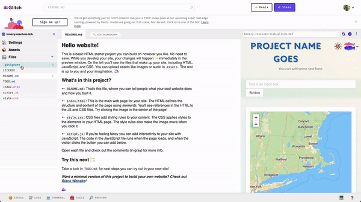

---

---

# Getting started with Glitch

## What is Glitch?

**[Glitch](https://www.glitch.com)** is an online development environment that lets you edit and publish your code within the same website.

If you're unfamiliar with writing code for web applications, you typically want at least these things in your workspace or **development environment**:

- a **text editor**, or an application in which you write your code (HTML, CSS, JavaScript)
- a **live reload feature**, so you can preview what your app will look like online
- a **web hosting service**, so that you can push your app to a website that others can access

<aside>

At the LMEC, we frequently use Glitch for our own data visualizations. Feel free to check out [some of our projects](https://www.leventhalmap.org/projects/digital-projects/glitch-dataviz/)!

</aside>

Glitch does all three of these things at once. You don't need to download anything; you can actively preview your application while writing code; and you don't need to find a web hosting service.

Conveniently for us, all of these benefits make Glitch a great tool for making & sharing web maps, too. Score!

## Remixing a Glitch project

Another exciting feature in Glitch is the ability to "remix" somebody else's code. To help folks get started with web maps or data visualizations, we've made a template that you can remix.

To get started:

1. Navigate to [Glitch's website](https://glitch.com) and create an account
2. Open up our [LMEC data viz starter pack](https://glitch.com/~lmec-dv-starter), a Glitch project that functions as a web map template
3. Click `"Remix your own"`

Welcome to your first Glitch project! You should see something like this:

|
|:--:|

<aside>

**Note:** Glitch automatically names remixed projects with three random words (mine above is called "brawny-resolute-tick"), so give your new project a better name. You can change the name by clicking `Settings` > `Edit project details`.

</aside>

There are three panes in the Glitch app. On the left side, the **file tree** shows all the files that comprise your project. In the middle, the **file editor** allows you to edit those files directly. And on the right side, the **preview pane** provides a fully rendered and actively updated view of your app.

In the preview pane, the web map is currently being rendered by three files in your file tree:

1. `index.html`
2. `script.js`
3. `style.css`

Without making any changes to the code (yet!), open and skim through each of these documents. What patterns do you notice? In the HTML document, for example, how many unique elements can you identify? In the JavaScript document, what are you curious about?

### Challenge

<Hideable>

Try changing the name of the web page to something other than "Your Project Goes."

</Hideable>

### Check your understanding

<Hideable>

<Quizlet
    :questions="[
        {text: 'Which file contains instructions for the font size and color of text?',
        answers: [
            {text: 'index.html'},
            {text: 'styles.css', correct: true},
            {text: 'script.js'}
        ]},
        {text: 'Which file contains instructions for how a user will interact with the map?',
        answers: [
            {text: 'index.html'},
            {text: 'styles.css'},
            {text: 'script.js', correct: true}
        ]},
        {text: 'Which file contains instructions for where the map container is positioned on the page?',
        answers: [
            {text: 'index.html', correct: true},
            {text: 'styles.css'},
            {text: 'script.js'}
        ]},
    ]"
>

</Quizlet>

</Hideable>