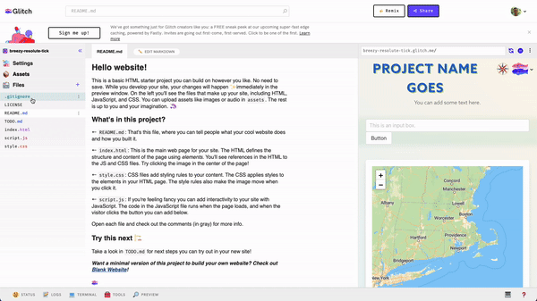

# Introduction to web mapping

## Web mapping

[QGIS](https://cartinal.leventhalmap.org/guides/getting-started-with-qgis/) is an excellent software for creating spatial data and static maps, but it's not as good for generating interactive maps that you can share on the web. **Web mapping** is the process of delivering geospatial data through the internet, as opposed to via files on your own computer.

If you want to create a map where your audience can:

- Pan around and zoom in/out
- Click data layers on and off
- Adjust layer opacity
- Share using a stable link

Then a web map is probably right for you!

In this tutorial, you'll learn how to create your very own web map using the JavaScript library [Leaflet](https://leafletjs.com) and the online development environment [Glitch](https://www.glitch.com).

It's okay if you don't know what those things mean just yet. That's what the tutorial is for! By the time you're done, you'll be able to create something like this:

<div class="glitch-embed-wrap" style="height: 420px; width: 100%;">
  <iframe
    src="https://glitch.com/embed/#!/embed/synagogues-example?path=index.html&previewSize=100"
    title="synagogues-example on Glitch"
    allow="geolocation; microphone; camera; midi; encrypted-media; xr-spatial-tracking; fullscreen"
    allowFullScreen
    style="height: 100%; width: 100%; border: 0;">
  </iframe>
</div>

### Differences between desktop and web mapping

This table details a few key differences between creating maps with a desktop GIS software (like QGIS) and creating maps in a web mapping environment.

|  | Desktop       | Web mapping      |
| --------------- | ------------- | ---------------- |
| **_Purpose_** | Project-oriented; best for data creation, manipulation, and analysis | Tool- and app-oriented; best for data visualization and user interactivity |
| **_Interface_** | Point-and-click or drag-and-drop in a graphical user interface | Edit raw files in a text editor or integrated development environment |
| **_Formats_** | Shapefiles for vector data, GeoTIFFs for raster data | GeoJSON for vector data, tile services for raster data |
| **_Programming languages_** | Python for spatial analysis and geoprocessing | HTML for structure, CSS for style, JavaScript for interaction |

This guide will walk you through the basics of creating a web map, from 

## What is Leaflet?


## Getting started with Glitch

Glitch, a web tool for real-time app development, will serve as our "home base" in this tutorial. It's where you'll store all your spatial data, as well as edit the files that will structure your web map.

1. Navigate to [Glitch's website](https://glitch.com) and create an account
2. Open up our [LMEC data viz starter pack](https://glitch.com/~lmec-dv-starter), a Glitch project that functions as a web map template
3. Click `"Remix your own"`

Welcome to your first Glitch project! You should see something like this:

|
|:--:|

<aside>

**Note:** Glitch automatically names remixed projects with three random words (mine above is called "brawny-resolute-tick"), so give your new project a better name. You can change the name by clicking `Settings` > `Edit project details`.

</aside>

There are three panes in the Glitch app. On the left side, the **file tree** shows all the files that comprise your project. In the middle, the **file editor** allows you to edit those files directly. And on the right side, the **preview pane** provides a fully rendered and actively updated view of your app.

In the preview pane, the web map is currently being rendered by three files in your file tree:

1. `index.html`
2. `script.js`
3. `style.css`

| | index.html | styles.css       | script.js      |
|--------------- | --------------- | ------------- | ---------------- |
| **_Language_** | [HTML](https://www.w3schools.com/html/html_intro.asp) | [CSS](https://developer.mozilla.org/en-US/docs/Learn/CSS/First_steps/What_is_CSS) | [JavaScript](https://developer.mozilla.org/en-US/docs/Learn/JavaScript/First_steps/What_is_JavaScript) |
| **_Purpose_** | Provide **structure, layout, and content** to a web page | Provide **style** to the structure, layout, and content | Allow **user interaction** with page content |
| **_Example_** | What text appears on your web page? Where does the map go? | In what font will the text be rendered? How big is the map? | Does the map have a zoom button? Can a user retrieve information by clicking on a feature? |

Each of these files contains code, or instructions, which tell a computer how to render parts of a page. Let's explore each file individually and see how changing its content affects our map.

### Dive into `index.html`

In your project, click on `index.html` to view its contents. You'll see a lot of angular brackets `< >`, or **tags**, throughout the file. Navigate to the section below...

```html
<section class="top-matter mb-4">
    <div class="glitchButton m-3" style="float:right;z-index:3">
    
    </div>
    <div class="container">
    <h1 class="heading is-size-2 has-text-centered">
        Project Name Goes
    </h1>
    <p class="has-text-centered">
        You can add some text here.
    </p>
    </div>
</section>
```
<aside>

**Note:** Titles like `index.html`, `styles.css`, and `script.js` are _mainly_ named as such by convention.

</aside>

...  and make a few changes!

1. Update the project name between the `<h1>` tags
2. Add some text between the `<p>` tags
3. OPTIONAL: Trade out the LMEC logo for a different one (you can do this by replacing the URL between quotes at the `src` tag with a different URL )

For an in-depth description of what different HTML tags and elements mean, check out [Mozilla's documentation on the topic](https://developer.mozilla.org/en-US/docs/Web/HTML). What else might you want to add or change about the structure of this page?

### Dive into `styles.css`


