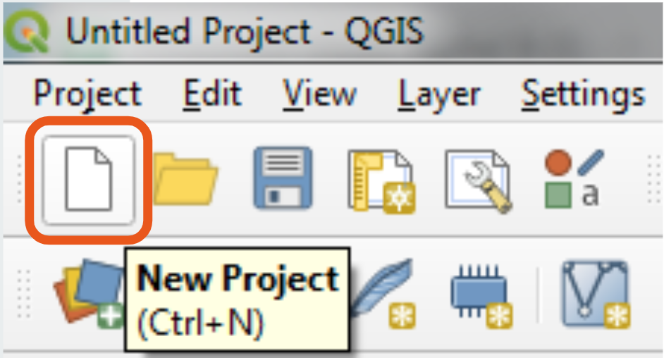

# Get Started with QGIS

## What is QGIS?
QGIS is a Free and Open Source (FOSS) GIS software application. You can download and run it on almost any operating system (Linux, Mac OSX, Unix, Windows, and Android). 

For most tasks you will undertake using GIS, QGIS is a great place to start. You can use it to:
- Create digital maps from existing data sources
- Perform spatial analysis
- Collect and parse geographic data from satellites, sensors, and other sources
- Manage the spatial attributes of data
- Much more!

## Installing QGIS

<a target = "_blank" href ='https://qgis.org/en/site/forusers/download.html'>Use this link to download QGIS.</a>

Select the appropriate version the software based on your computer's operating system. 
(If you're new to GIS and unsure which version to download, the **Long term release** under the **QGIS Standalone Installer** is your safest bet.)

::: details Curious about all the other download options?

QGIS has a [comprehensive installation guide](https://qgis.org/en/site/forusers/alldownloads.html) that explains the differences between packages and versions in detail.

::: danger WINDOWS USERS:
*Only install in OSGeo4W if you know what you’re doing!* A full install of OSGeo4W could render your whole installation *unusable* without additional modifications and installations!
:::

Once your installation is complete, open up QGIS by clicking on  in your Applications.

## Understanding the QGIS Interface
If you have QGIS installed and opened, you may be wondering "What do I do now?"

To open a new project, select the **New Project** icon in the top left of the window.

When opened in QGIS, your new document should look like this (minus the flashing labels).

These labels correspond to important functional components of your QGIS working document. From here, we'll show you how to understand and navigate these components and highlight some important common features located in each.

### Menu Bar

This bar holds the most basic functionality having to do with your current project. 

Under `Project`, you can **Open** a new or existing document, **Save** your current document, or **Export** it in a different file format compatible with a different software. 

Here you can also create a **Print Layout**, a map document formatted for presentation or inclusion in a report. For information about print layouts, see our [Create a Print Layout guide](https://geoservices.leventhalmap.org/cartinal/). 

Under `Layer`, you can use the `Data Source Manager` to **Add Data** to your map project. This data can take the form of vector data, raster data, data tables, and more. For more information on the types of data compatible with QGIS, see our [GIS Data Types and Formats guide](https://geoservices.leventhalmap.org/cartinal/).

Under `Plugins`, you can access plugins that will allow you to perform initial tasks beyond QGIS's core functionality. Like QGIS itself, plugins are coded open source by developers, and are available for free. For many common tasks, such as **Georeferencing** and **Geocoding**, installing or enabling an appropriate plugin is necessary.

### Toolbars

Towards the top of the he QGIS interface is a customisable area where various **Toolbars** are found. A wide variety of tools can be found here, including the most universally used tools, the **Navigation Tools**.

The **Pan Tool**  allows you to pan across your map document.

The **Zoom Tools**  will allow you to zoom in and out of your map. You can also zoom by using the scroll wheel on your mouse.

::: tip Understanding Your Mouse
In QGIS, your mouse is not a neutral item. Clicking will typically perform a task that corresponds to the tool you have selected. For example, if you are using the **Zoom Tools**, you will zoom in or out of your map document with each click. If you are using **Measure Line Tool**, with each click you you will create connected vertices that QGIS will measure. 
:::

Tools are grouped into toolbars according to collections of tasks relevant to particular kinds of projects. Depending on what you're working on, you will use some tools more than others, and you may not need some at all. The toolbars are easily customizable using this icon , as demonstrated in the gif below:

You can toggle toolbars on and off through the **Menu Bar** by navigating to `View > Toolbars` and then checking or unchecking the available toolbars according to your preference.

### Browser Panel

### Map Canvas

### Layers List