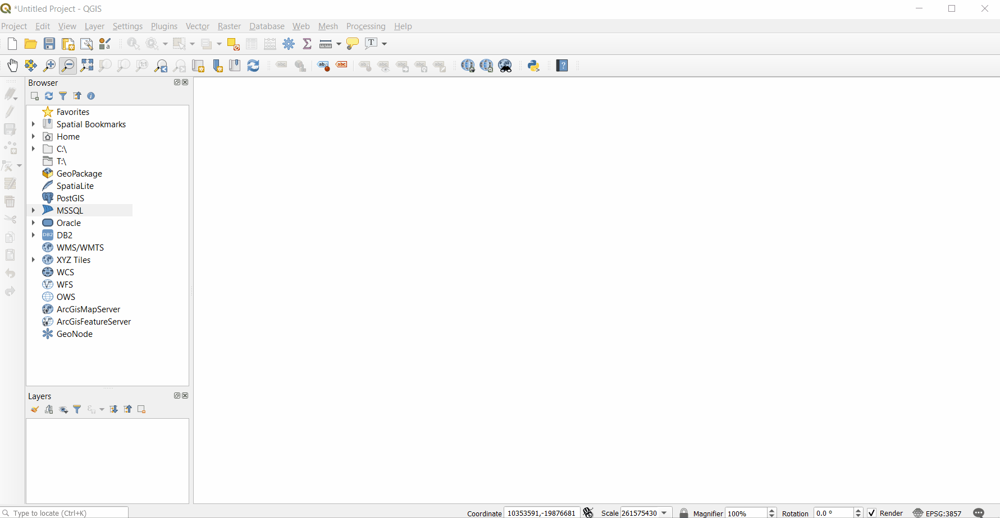
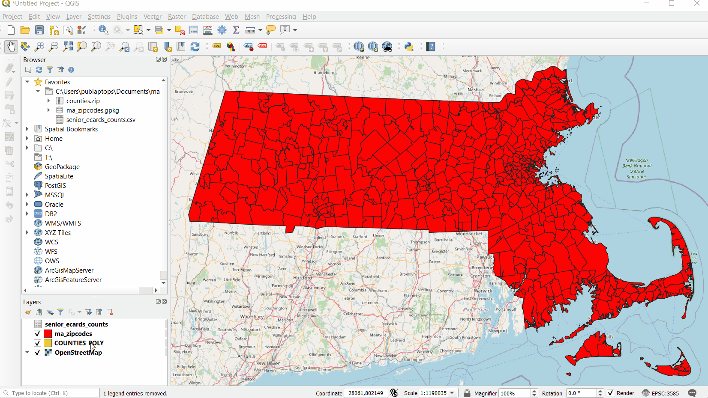

# Get Started with QGIS

## What is QGIS?
QGIS is a Free and Open Source (FOSS) GIS software application. You can download and run it on almost any operating system (Linux, Mac OSX, Unix, Windows, and Android). 

For most tasks you will undertake using GIS, QGIS is a great place to start. You can use it to:
- Create digital maps from existing data sources
- Perform spatial analysis
- Collect and parse geographic data from satellites, sensors, and other sources
- Manage the spatial attributes of data
- Much more!

## Installing QGIS

<a target = "_blank" href ='https://qgis.org/en/site/forusers/download.html'>Use this link to download QGIS.</a>

Select the appropriate version the software based on your computer's operating system. 
(If you're new to GIS and unsure which version to download, the **Long term release** under the **QGIS Standalone Installer** is your safest bet.)

::: details Curious about all the other download options?

QGIS has a [comprehensive installation guide](https://qgis.org/en/site/forusers/alldownloads.html) that explains the differences between packages and versions in detail.

:::

::: danger WINDOWS USERS:
*Only install in OSGeo4W if you know what you’re doing!* A full install of OSGeo4W could render your whole installation *unusable* without additional modifications and installations!
:::

Once your installation is complete, open up QGIS by clicking on  in your Applications.

## Understanding the QGIS Interface

::: tip NOTE
The screenshots and gifs used in this guide were made on a Windows computer running on **QGIS 3.10.3**. If you are using a different version of the software or running it on a different operating system, your interface may look slightly different. Don't panic! If your version of QGIS is up-to-date (3.10 or later), you will have access to all the same buttons and functions. Older versions of QGIS will vary more greatly, but should still allow you to perform all the tasks in this guide.
:::

If you have QGIS installed and opened, you may be wondering "What do I do now?"

To open a new project, select the **New Project** icon in the top left of the window.

When opened in QGIS, your new document should look like this (minus the flashing labels).

These labels correspond to important functional components of your QGIS working document. From here, we'll show you how to understand and navigate these components and highlight some important common features located in each.

### Menu Bar

This bar holds the most basic functionality having to do with your current project. 

Under `Project`, you can **Open** a new or existing document, **Save** your current document, or **Export** it in a different file format compatible with a different software. 

Here you can also create a **Print Layout**, a map document formatted for presentation or inclusion in a report. For information about print layouts, see our [Create a Print Layout guide](https://geoservices.leventhalmap.org/cartinal/guides/print-layout.html). 

Under `Layer`, you can use the `Data Source Manager` to **Add Data** to your map project. This data can take the form of vector data, raster data, data tables, and more. For more information on the types of data compatible with QGIS, see our [GIS Data Types and Formats guide](https://geoservices.leventhalmap.org/cartinal/).

Under `Plugins`, you can access plugins that will allow you to perform initial tasks beyond QGIS's core functionality. Like QGIS itself, plugins are coded open source by developers, and are available for free. For many common tasks, such as **Georeferencing** and **Geocoding**, installing or enabling an appropriate plugin is necessary.

### Toolbars

Towards the top of the QGIS interface is a customisable area where various **Toolbars** are found. A wide variety of tools can be found here, including the most universally used tools, the **Navigation Tools**.

The **Pan Tool**  allows you to pan across your map document.

The **Zoom Tools**  will allow you to zoom in and out of your map. You can also zoom by using the scroll wheel on your mouse.

::: tip Understanding Your Mouse
The way your mouse and trackpad actions correspond to QGIS functionalities will change depending on the tool you have selected. This may seem a little obvious, but being aware of this can prevent confusion. 
For example, if you are using the **Zoom Tools**, clicking the document will zoom the interface in and out. If you are using **Measure Line Tool**, however, each click will create connected vertices that QGIS will measure. 
:::

Tools are grouped into toolbars according to collections of tasks relevant to particular kinds of projects. Depending on what you're working on, you will use some tools more than others, and you may not need some at all. The toolbars are easily customizable using this icon , as demonstrated in the gif below:

You can toggle toolbars on and off through the **Menu Bar** by navigating to `View > Toolbars` and then checking or unchecking the available toolbars according to your preference.

### Browser Panel

The **Browser Panel** allows you to easily pull pre-existing data into your QGIS project. This panel connects to your computer, storage devices, common geographic databases and networks, and allows you to access QGIS-compatible files and tiled maps that you may want to use.

If you're new to GIS, don't be intimidated by all the unfamiliar options listed here. The majority of these (SpatialLite, Oracle, PostGIS, MSSQL, etc.) are databases that hold different types of geographic data or information. You won't need to be familiar with them just yet.  

#### Add a Basemap

Under `XYZ Tiles`, you can access URL-based **tiled web maps** to use in your project. These detailed maps can make great **basemaps** for your GIS project. A basemap is a background map layer that provides spatial reference for the project you are working on. Although it is not always necessary, a basemap can be helpful for orientation and interpretation as you create, edit, or analyze geographic data. 

For this exercise, we will use [OpenStreetMap (OSM)](https://www.openstreetmap.org/#map=4/38.01/-95.84) as our basemap. 

::: details Why OSM?
OSM is a free community-built open-source tiled world map that comes pre-loaded into QGIS. You can connect your `Browser` to other tiled web map services with more specific relevance to your project, for instance, if you are working on a project dealing with the natural environment, you may want a reference basemap showing elevation, but for referencing current streets and built-environment, OSM is a comprehensive and up-to-date choice.
:::

To add OSM to your project, navigate to `Browser > XYZ Tiles`, *right click* on `OpenStreetMap` in the dropdown, then select `Add Layer to project`.

OSM will appear in your **Map Canvas** as well as your **Layers List**.

::: tip 
Double-clicking will also add a layer to the project.
:::

#### Add Data from your Device
From the `Browser`, you can also quickly access any files stored on your computer or an external storage device and add them to your QGIS project. 

To add data from your computer to your project, navigate to the relevant folder in your `Browser`, locate your files, and **double-click**. 

::: tip NOTE
The file tree in your `Browser` matches that of your device. However, *it will only display files that are compatible with QGIS*. This makes locating relevant data much easier. 

Here is a screenshot of the folder used in the above gif. Notice that the word document located in the folder did not appear in the QGIS browser.

:::

If there is a folder on your system that you will be using a lot of data from, you can add it to your `Favorites` in your `Browser` so its contents are easier to access. To do this, navigate to the folder as demonstrated above, right-click, then select `Add as a Favorite`. 

::: tip 
In the `Browser` you also have the ability to browse and open zip files directly.
:::

### Map Canvas
The **Map Canvas** is where the visual aspect of your mapping data comes to life. Try it out by navigating around the basemap using the **Pan Tool**, the **Zoom Tool**, and others discussed above.

#### Coordinate Systems
The appearance of your map is based on the **coordinate reference system (CRS)** in which it is rendered. Because your computer screen is flat, any map you look at in a GIS will use a CRS to convert the spherical surface of the Earth to fit in the rectangular space of the **Map Canvas**. This process always involves distortion of size, shape, and distance. There are many different coordinate systems, and your choice will vary depending on the goals of your project. 

EPSG is a registry of spatial reference systems. Referring to a reference system's EPSG code is a common way to communicate that reference system with whatever software you are using. To search for EPSG codes based on locations, you can go to [EPSG.io](https://epsg.io/).

For the purposes of this demo, we will use **EPSG: 3585**, a coordinate system that accurately depicts the state of Massachusetts.

To change coordinate systems, find the **CRS button**  at the bottom-right of your map canvas and click on it. In the search bar at the top of the pop-up window, **type** in the name or number of your desired CRS, and then **select** that CRS from the options that appear. Finally, click `Apply` to apply this change and `OK` to exit out of the window.

Notice the change in the warp of the basemap.

::: warning
Troubleshooting the CRS of your data and map document is a common GIS frustration. If something isn't showing up as anticipated, there is likely a projection issue. Always verify that your project and all your data are in the desired coordinate system!
:::

### Layers List

The **Layers List** is the final basic component of the QGIS interface. Here you will find all data layers that have been added to your project. 

&nbsp;

&nbsp;

**Zoom** to the geographic extent of a layer, by right-clicking on it and selecting `Zoom to Layer`.

**Rearrange** layers by dragging and dropping them in the list.

**Toggle** layers on and off using the check-box to the left of the layer name. 
 

::: tip NOTE
QGIS can support data that does not contain any spatial components. This data can be processed, operated on, or combined with spatial data in the software. Tabular data loaded into the QGIS will appear in the **Layers List** but not in the **Map Canvas**.
:::

&nbsp;

Now that you understand the basics of the QGIS interface, see [our other guides](https://geoservices.leventhalmap.org/cartinal/) to learn how to perform specific tasks in QGIS.