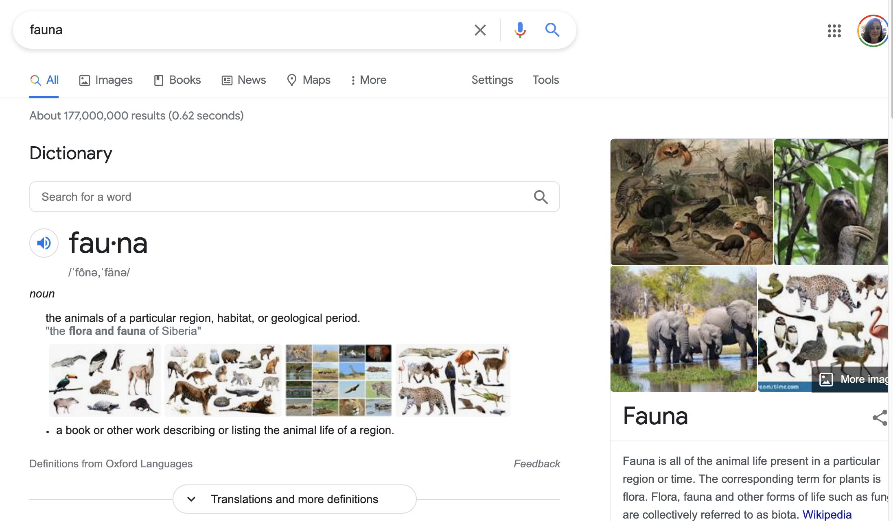

# Using Fauna: a serverless database service

## What is Fauna?

There are many situations where you may need to read and write data to a database without a complicated server setup. We have chosen to use the service [Fauna](https://fauna.com/) to do so.

Our Fauna account as of June 2021 holds the following:
- A database of unique identifiers associated with the public data portal
- Various databases which enable the ability for crowd-contributions in LMEC web projects, including: 
    - Bending Lines digital interactive, Do You Trust This Map
    - Beta versions of Atlascope v. 2, including "build your own historical tour" functionality
    - User contributed info for Map Stories, the conceptual predecessor to the Movie Maps software

## How do I access our Fauna account?

To access and manage our Fauna databases, you can find the Fauna password in the LMEC password manager. 

::: tip BELLE TIP

Fauna used to be called FaunaDB.

If you search for just Fauna, and get this...

Try Googling "FaunaDB"

: ) 

:::

## How do I read and write to Fauna from my digital project?

Fauna's query language is called FQL and it is [well documented](https://docs.fauna.com/fauna/current/api/fql/).

### LMEC code examples writing to Fauna

To see some examples of how we have used Fauna before in digital projects, check these out:

- [Static site example](https://github.com/nblmc/bl-trustworthy/tree/master/src)
*This example writes user contributed votes from the [Do You Trust This Map digital interactive](https://www.leventhalmap.org/digital-exhibitions/bending-lines/how-to-bend/interactive-trust/) from Bending Lines*

::: warning

The above **Do You Trust This Map** Github repository is private and in the legacy `nblmc` Github account. You will need to log in with the password from the LMEC password manager.

:::

- [Vue app code example](https://github.com/bplmaps/identifier-mint/blob/main/src/Minter.vue)
*This example is from the app which [mints unique IDs for datasets in the data portal](https://geoservices.leventhalmap.org/identifier-mint/)*

